# TY-Multiverse-Backend
個人網站後端系統

## 架構設計

### 1. Redis Session 架構
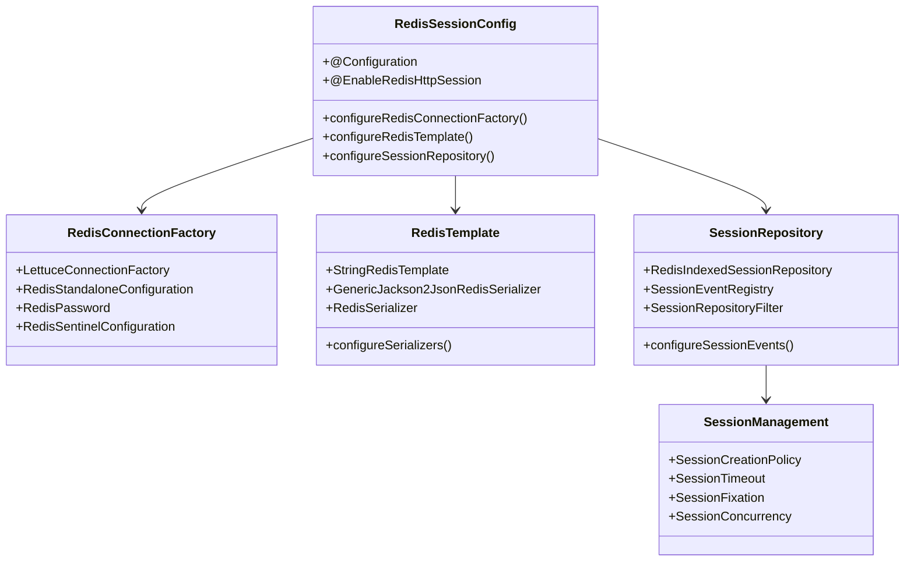

### 2. 核心架構
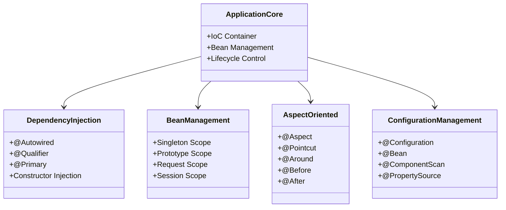

### 3. 領域驅動設計 (DDD) 架構
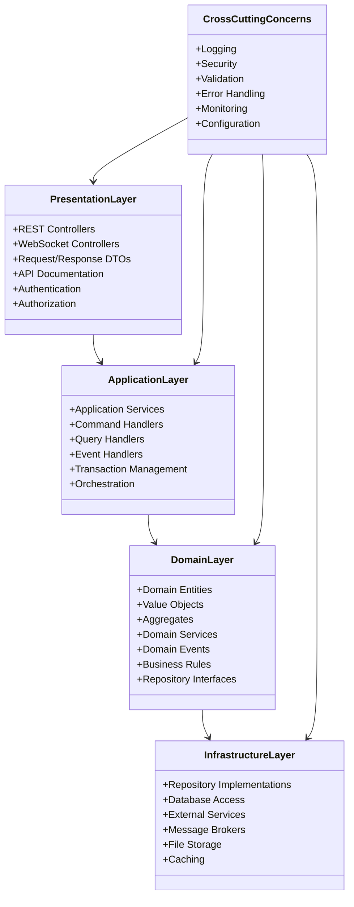

### 4. 傷害計算策略模式架構
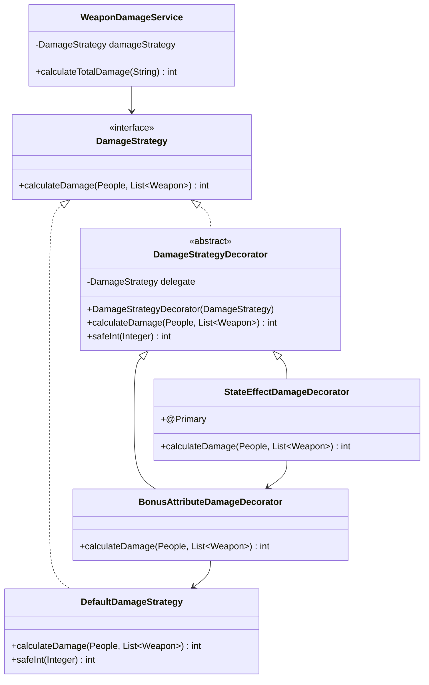

### 5. 設計模式與工廠架構
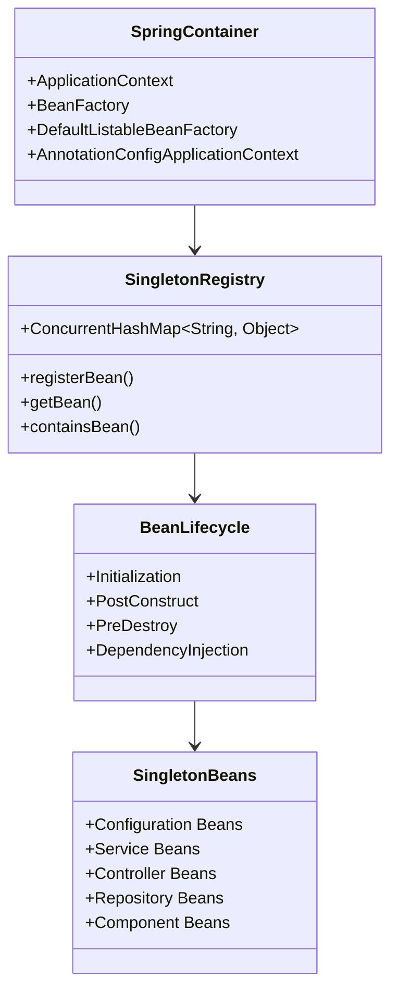

### 6. IoC/AOP 架構
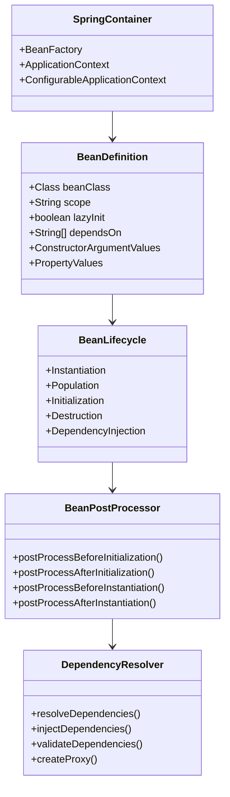

## 安全認證架構

### 1. Keycloak JWT 認證架構
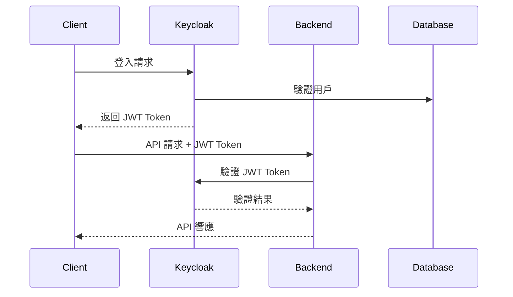

## 錯誤處理架構
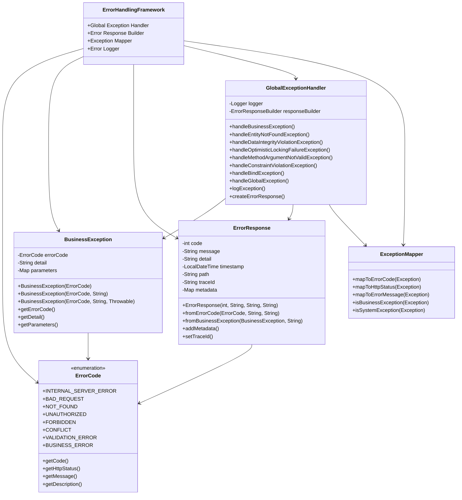

## 監控與健康檢查
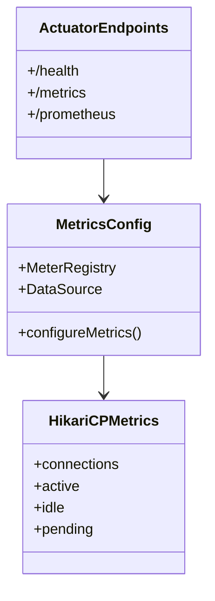

## 單元測試架構
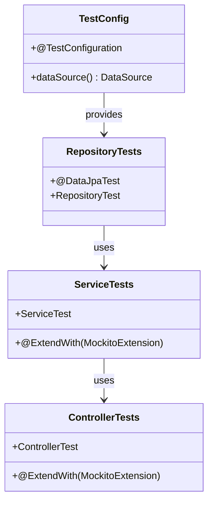

## CI/CD Pipeline
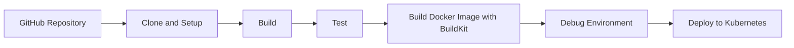

## 文檔與工具

### Swagger UI
- 本地環境：`http://localhost:8080/tymb/swagger-ui/index.html#/`
- 生產環境：`https://peoplesystem.tatdvsonorth.com/tymb/swagger-ui/index.html#/`

### JavaDoc 文檔
- 本地環境：`http://localhost:8080/tymb/javadoc/index.html`
- 生產環境：`https://peoplesystem.tatdvsonorth.com/tymb/javadoc/index.html`

### Docker 建置
- 建置指令：`docker build -t papakao/ty-multiverse-backend:latest .`
- 多平台建置：`docker buildx build --platform linux/arm64 -t papakao/ty-multiverse-backend:latest --push .`