# TY-Multiverse-Backend
Personal Website Backend System

## 🔧 開發環境設定

### 依賴管理架構

本專案使用 **統一的依賴管理架構**，透過 Maven 從本地或遠端倉庫引用共用程式庫 `ty-multiverse-common`。

#### 架構說明
- **統一 common 模組**：所有共用程式碼集中在單一專案中管理
- **自動依賴解析**：Maven 自動處理模組間的依賴關係
- **版本同步**：所有專案使用相同版本的 common 模組

#### 開發環境設定
```bash
# 確保 common 模組已建置並安裝到本地倉庫
cd ../ty-multiverse-common
mvn clean install

# 檢查依賴關係
mvn dependency:tree | grep ty-multiverse-common
```

#### Common 模組更新流程
```bash
# 1. 在 common 目錄中進行開發
cd ../ty-multiverse-common
git checkout -b feature/new-enhancement
# ... 修改程式碼 ...

# 2. 建置並安裝到本地倉庫
mvn clean install

# 3. 提交並推送變更
git add .
git commit -m "Add new enhancement"
git push origin feature/new-enhancement

# 4. 其他專案會自動使用更新後的版本
cd ../ty-multiverse-backend
mvn clean compile  # 自動使用新版本的 common
```

## 🚀 本地開發啟動

### 啟動指令

#### 完整構建和啟動（推薦用於全新專案或清理後）

```bash
# 方法 1：正確的編譯指令（推薦）
mvn clean generate-sources compile
mvn spring-boot:run

# 方法 2：一次性執行（包含編譯和運行）
mvn clean generate-sources compile spring-boot:run
```

**📋 指令說明：**
- `clean` - 清空舊的編譯結果
- `generate-sources` - 生成 protobuf gRPC 類別
- `compile` - 編譯所有源代碼
- `spring-boot:run` - 啟動 Spring Boot 應用

#### 快速啟動（日常開發使用）

```bash
# 啟動後端服務（包含 gRPC 服務器）
mvn spring-boot:run

# 或使用 Maven Wrapper
./mvnw spring-boot:run
```

**Maven vs Maven Wrapper：**
- `mvn`: 使用系統安裝的 Maven（需要手動安裝）
- `./mvnw`: Maven Wrapper，自動下載並使用專案指定的 Maven 版本（推薦）
- 功能相同，但 Maven Wrapper 確保團隊成員使用相同版本，避免版本衝突

**服務器啟動資訊：**
- **HTTP API**: `http://localhost:8080/tymb`
- **gRPC Server**: `localhost:50051` (PeopleService)
- **Swagger UI**: `http://localhost:8080/tymb/swagger-ui/index.html`
- **JavaDoc**: `http://localhost:8080/tymb/javadoc/index.html`

**注意事項：**
- 確保 PostgreSQL 和 Redis 服務正在運行
- gRPC 服務器會自動在端口 50051 啟動
- 查看啟動日誌確認 gRPC 服務器狀態

### gRPC 服務處理模式

目前使用**同步處理模式**：

```
Gateway gRPC Client → Backend gRPC Server → 直接查詢數據庫 → 返回結果
```

- ✅ 響應快速，延遲低
- ✅ 架構簡單，易於維護
- ✅ 適合開發和測試環境

**備註：** 如需異步處理模式，可以參考 Consumer 項目的 README 配置 RabbitMQ。

## 🛡️ Middleware/Filter 架構設計

### 為什麼需要 Middleware？

在現代 Web 應用中，請求處理不應該只關注業務邏輯。Middleware（中間件）允許我們在請求的各個階段插入橫切關注點，而無需修改核心業務代碼。

**核心原理：**
- **請求生命週期**：HTTP請求 → Tomcat → Filter鏈 → Spring MVC → Interceptor鏈 → Controller
- **責任鏈模式**：每個中間件都可以處理請求、傳遞控制權，或終止請求
- **AOP概念**：在不修改原始代碼的情況下添加額外功能

### Backend 中間件使用情況

#### 1. Servlet Filter 層級

**RequestConcurrencyLimiter** - 請求併發控制：
```java
@Component
public class RequestConcurrencyLimiter implements Filter {
    @Override
    public void doFilter(ServletRequest request, ServletResponse response, FilterChain chain) {
        // 實現請求併發限制邏輯
        // 防止過多併發請求影響系統穩定性
    }
}
```
- **位置**：Spring MVC 之前，最早的防線
- **職責**：控制請求併發數量，保護系統資源

#### 2. AOP Aspect 層級

**RateLimiterAspect** - 限流保護：
```java
@Aspect
@Component
public class RateLimiterAspect {
    @Around("@annotation(RateLimit)")
    public Object enforceRateLimit(ProceedingJoinPoint joinPoint) throws Throwable {
        // 實現基於 Redis 的分散式限流
        // 防止 API 濫用和惡意攻擊
    }
}
```
- **位置**：方法執行前攔截
- **職責**：API 調用頻率控制，防止服務過載

#### 3. Spring Security Filter 鏈

**JWT 認證過濾器**：
```java
@Configuration
@EnableWebSecurity
public class SecurityConfig {
    @Bean
    public SecurityFilterChain filterChain(HttpSecurity http) {
        http.addFilterBefore(jwtAuthenticationFilter(),
                           UsernamePasswordAuthenticationFilter.class);
    }
}
```
- **位置**：Security 過濾器鏈中
- **職責**：JWT Token 驗證，用戶身份認證

### 中間件選擇指南

| 需求場景 | 推薦方案 | 理由 |
|---------|----------|------|
| 🔐 **身份認證** | Filter | 在業務邏輯前就攔截無效請求 |
| 📊 **日誌記錄** | Interceptor | 需要知道具體的 Controller 方法 |
| ⚡ **性能監控** | Aspect/Filter | 精確測量方法執行時間 |
| 🛡️ **統一錯誤處理** | @ControllerAdvice | 所有異常的集中處理點 |
| 🚦 **請求限流** | Filter/Aspect | 早期拒絕過多請求，節省資源 |

### 架構優勢

1. **關注點分離**：業務邏輯與基礎設施邏輯完全解耦
2. **代碼重用**：通用功能（如認證、限流）可在多個服務間共享
3. **易於測試**：每個中間件都可以單獨測試
4. **易於維護**：修改中間件邏輯不會影響業務代碼
5. **性能優化**：可以在最早階段拒絕無效請求

### 配置方式

```properties
# 中間件相關配置
app.middleware.concurrency.max-requests=100
app.middleware.rate-limit.enabled=true
app.middleware.rate-limit.requests-per-minute=60

# Spring Security 配置
spring.security.enabled=true
jwt.secret=your-secret-key
```

### 監控與調試

- **日誌記錄**：每個中間件都應記錄關鍵操作
- **性能指標**：監控中間件處理時間和成功率
- **健康檢查**：確保中間件正常運行

**相關文件：**
- `src/main/java/tw/com/tymbackend/config/SecurityConfig.java`
- `src/main/java/tw/com/tymbackend/filter/RequestConcurrencyLimiter.java`
- `src/main/java/tw/com/tymbackend/aspect/RateLimiterAspect.java`

## Architecture Design

### 1. Core Architecture
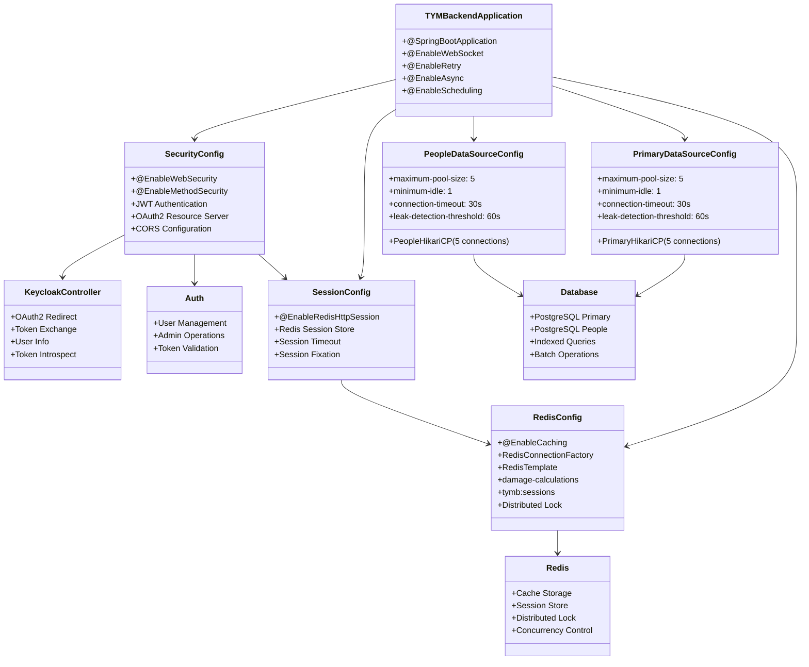

### 2. Module Architecture
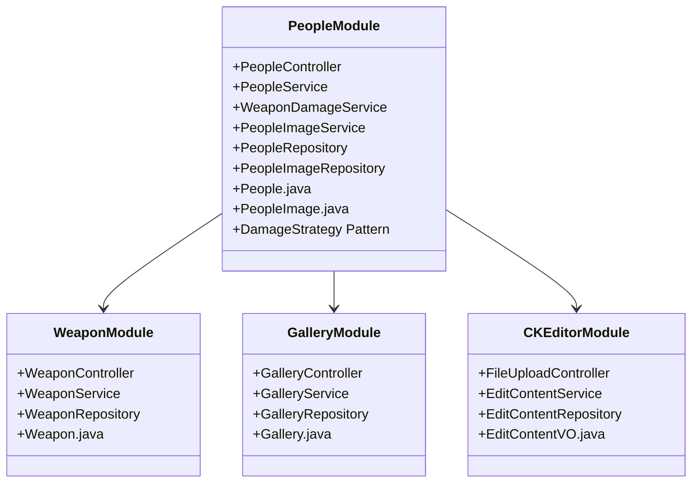

### 3. Database Optimization Architecture
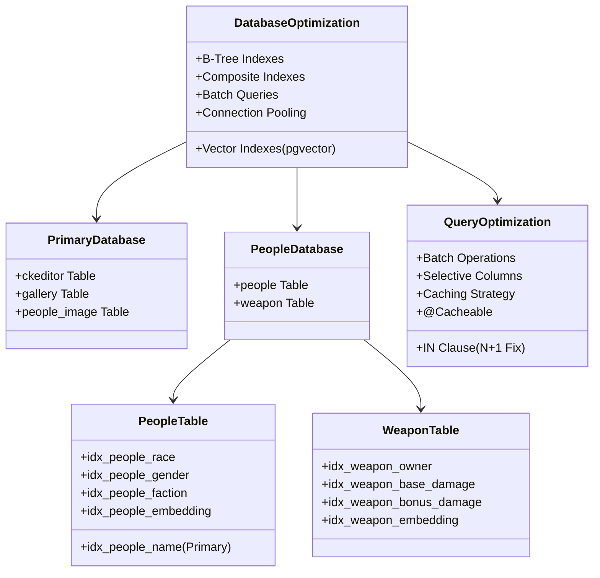

### 4. Cache Architecture
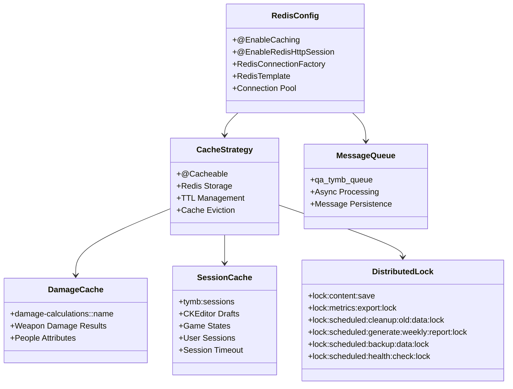
### 4.2. Lua Script Flow
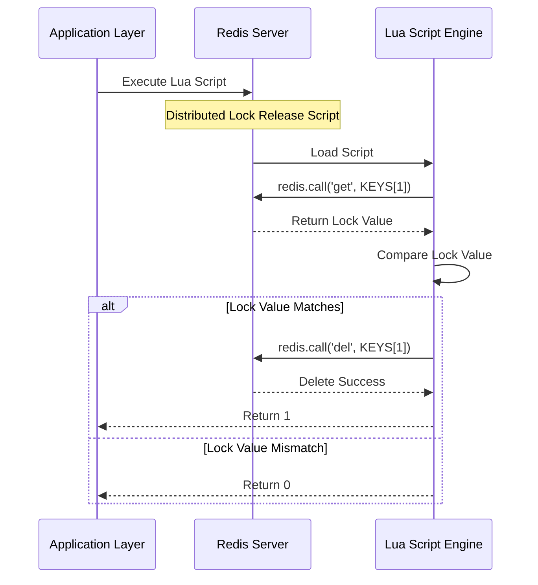

### 4.2.1. Distributed Lock Usage Scenario
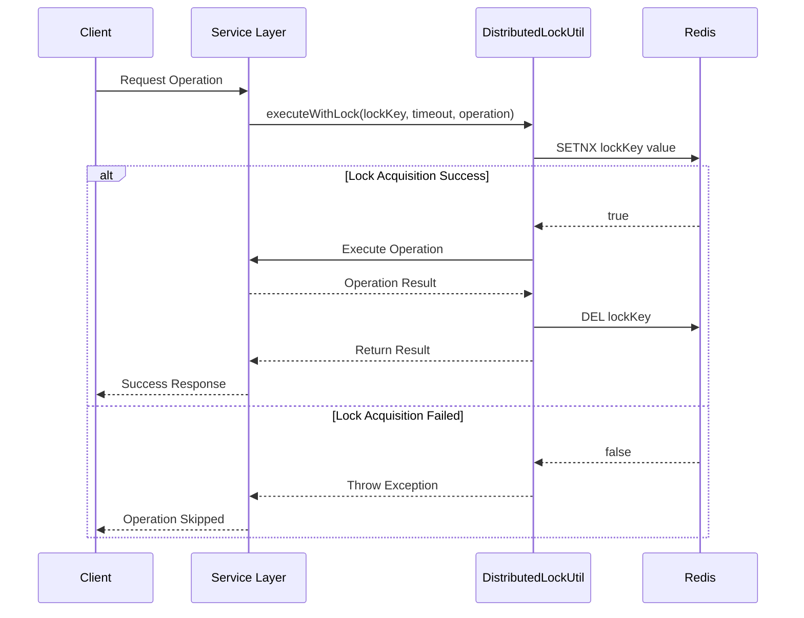

### 5. Connection Pool Architecture
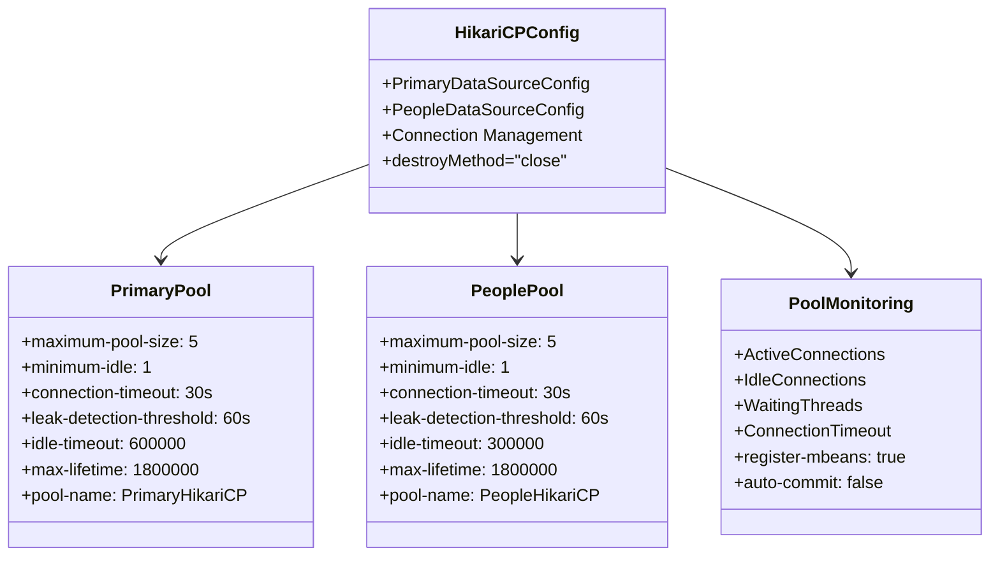

### 6. Security Authentication Architecture
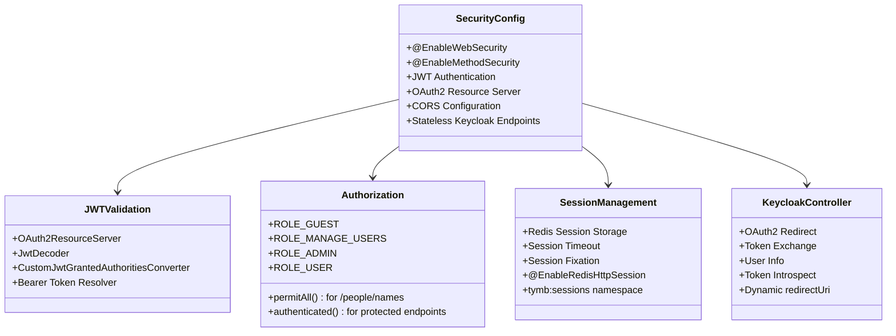

### 7. Error Handling Architecture
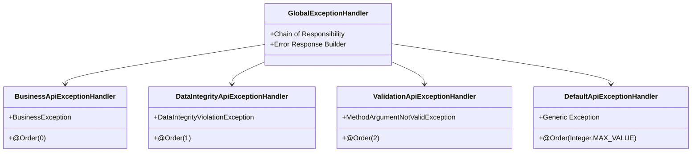

### 8. Monitoring Architecture
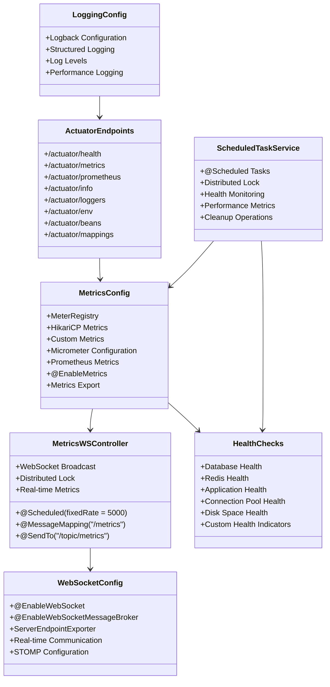

### 9. gRPC Service Architecture

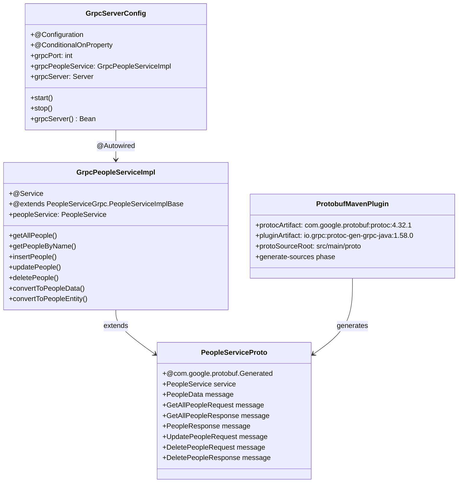

### 9.1. Protocol Buffers 定義

```protobuf
// people_service.proto
syntax = "proto3";

option java_multiple_files = true;
option java_package = "tw.com.tymbackend.grpc.people";
option java_outer_classname = "PeopleServiceProto";

package tymbackend.people;

// People Service - 人物服務
service PeopleService {
  // 獲取所有人物
  rpc GetAllPeople(GetAllPeopleRequest) returns (GetAllPeopleResponse);

  // 根據名稱獲取人物
  rpc GetPeopleByName(GetPeopleByNameRequest) returns (PeopleResponse);

  // 插入人物
  rpc InsertPeople(PeopleData) returns (PeopleResponse);

  // 更新人物
  rpc UpdatePeople(UpdatePeopleRequest) returns (PeopleResponse);

  // 刪除人物
  rpc DeletePeople(DeletePeopleRequest) returns (DeletePeopleResponse);
}

// People 數據模型 - 完整字段映射
message PeopleData {
  string name = 1;                    // 主鍵
  string name_original = 2;           // 原始名稱
  string code_name = 3;               // 代號

  // 力量屬性
  int32 physic_power = 4;             // 物理力量
  int32 magic_power = 5;              // 魔法力量
  int32 utility_power = 6;            // 實用能力

  // 基本信息
  string dob = 7;                     // 出生日期
  string race = 8;                    // 種族
  string attributes = 9;              // 屬性
  string gender = 10;                 // 性別

  // 身體特徵
  string ass_size = 11;               // 臀部尺寸
  string boobs_size = 12;             // 胸部尺寸
  int32 height_cm = 13;               // 身高(cm)
  int32 weight_kg = 14;               // 體重(kg)

  // 職業和技能
  string profession = 15;             // 職業
  string combat = 16;                 // 戰鬥能力
  string job = 17;                    // 工作
  string physics = 18;                // 物理特性

  // 個性特徵
  string known_as = 19;               // 別名
  string personality = 20;            // 個性
  string interest = 21;               // 興趣
  string likes = 22;                  // 喜好
  string dislikes = 23;               // 厭惡
  string favorite_foods = 24;         // 喜愛的食物

  // 關係和組織
  string concubine = 25;              // 後宮
  string faction = 26;                // 派系
  int32 army_id = 27;                 // 軍隊編號
  string army_name = 28;              // 軍隊名稱
  int32 dept_id = 29;                 // 部門編號
  string dept_name = 30;              // 部門名稱
  int32 origin_army_id = 31;          // 原始軍隊編號
  string origin_army_name = 32;       // 原始軍隊名稱

  // 其他信息
  bool gave_birth = 33;               // 是否生育
  string email = 34;                  // 電子郵件
  int32 age = 35;                     // 年齡
  string proxy = 36;                  // 代理

  // JSON 屬性
  string base_attributes = 37;        // 基礎屬性(JSON)
  string bonus_attributes = 38;       // 加成屬性(JSON)
  string state_attributes = 39;       // 狀態屬性(JSON)

  // 元數據
  string created_at = 40;             // 創建時間
  string updated_at = 41;             // 更新時間
  int64 version = 42;                 // 版本號(樂觀鎖)
}

// 請求和響應消息
message GetAllPeopleRequest {}

message GetAllPeopleResponse {
  repeated PeopleData people = 1;
}

message GetPeopleByNameRequest {
  string name = 1;
}

message UpdatePeopleRequest {
  string name = 1;
  PeopleData people = 2;
}

message DeletePeopleRequest {
  string name = 1;
}

message PeopleResponse {
  bool success = 1;
  string message = 2;
  PeopleData people = 3;
}

message DeletePeopleResponse {
  bool success = 1;
  string message = 2;
}
```

### 9.2. gRPC 服務實現架構

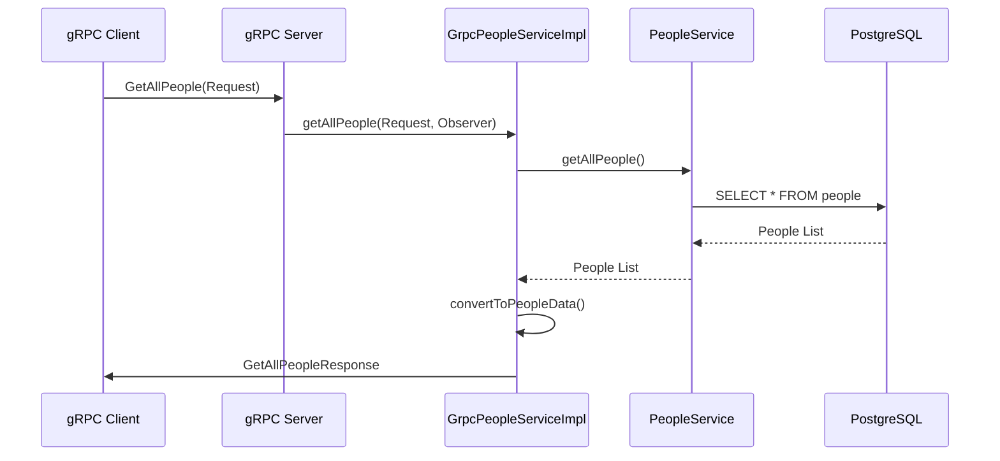

**架構說明：**

- **Protocol Buffers**: 使用 `.proto` 文件定義服務介面和數據結構，支援跨語言通訊
- **程式碼生成**: Maven 插件自動生成 Java 類別，包含服務介面和數據模型
- **服務實現**: `GrpcPeopleServiceImpl` 繼承生成的基類並實現業務邏輯
- **服務器配置**: `GrpcServerConfig` 配置並啟動 gRPC 服務器
- **依賴注入**: Spring 容器管理服務實例和依賴關係
- **條件啟用**: 透過 `grpc.enabled=true` 環境變數控制 gRPC 服務啟用
- **錯誤處理**: 統一的異常處理機制
- **請求響應日誌**: 自動記錄所有 Controller 的請求和響應日誌
- **效能優化**: 使用連接池和快取提升服務效能

**技術特點：**
- **雙向通訊**: 支援 Unary、Server Streaming、Client Streaming 和 Bidirectional Streaming
- **類型安全**: 編譯時類型檢查，減少運行時錯誤
- **高效序列化**: Protocol Buffers 提供高效的二進位序列化
- **語言中立**: 支援多種語言實現，方便微服務架構整合
- **服務發現**: 可與服務網格（如 Istio）整合進行服務發現和負載均衡

**環境配置：**
```properties
# 啟用 gRPC 服務
grpc.enabled=true
grpc.port=50051

# 依賴版本
grpc.version=1.58.0
protobuf.version=4.32.1
protoc.version=4.32.1
```

### 9.3. RabbitMQ Data Flow Architecture

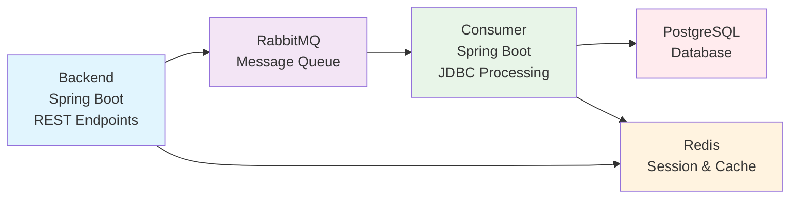

**架構說明：**
- **Backend (Producer)**: Spring Boot 應用程式，提供 REST API 端點，負責接收請求並發送訊息到 RabbitMQ
- **Consumer**: Spring Boot 應用程式，使用 JDBC 處理訊息並將數據寫入 PostgreSQL 資料庫
- **RabbitMQ**: 訊息佇列，實現非同步處理和解耦
- **PostgreSQL**: 主要資料庫，儲存處理後的數據
- **Redis**: 會話儲存、快取和分散式鎖，支援 `tymb:sessions` 和 `damage-calculations` 命名空間
- **Session 使用**: 目前僅 CKEditor 和 DeckOfCards 模組使用 Session 認證
- **其他模組**: 使用 JWT 無狀態認證

## Documentation and Tools
- Local Environment: `http://localhost:8080/tymb/swagger-ui/index.html#/`
- Production Environment: `https://peoplesystem.tatdvsonorth.com/tymb/swagger-ui/index.html#/`

### JavaDoc Documentation
- Local Environment: `http://localhost:8080/tymb/javadoc/index.html`
- Production Environment: `https://peoplesystem.tatdvsonorth.com/tymb/javadoc/index.html`

### Docker Build
- Build Command: `docker build -t papakao/ty-multiverse-backend:latest .`
- Multi-platform Build: `docker buildx build --platform linux/arm64 -t papakao/ty-multiverse-backend:latest --push .`
