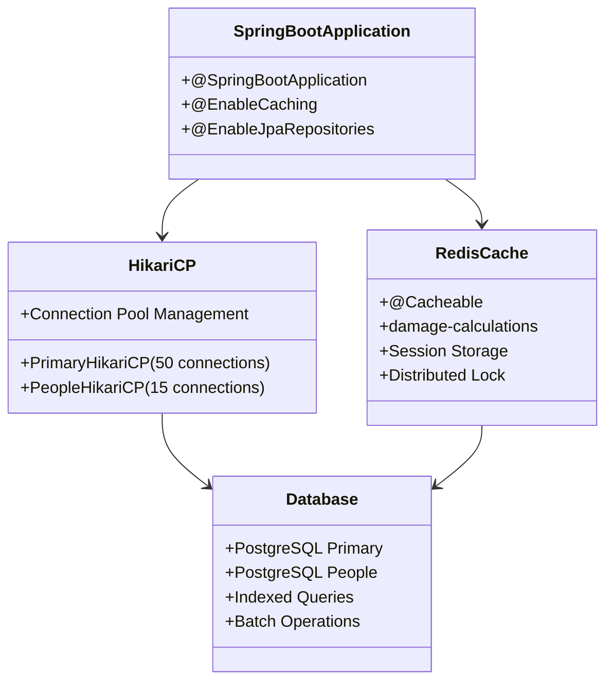
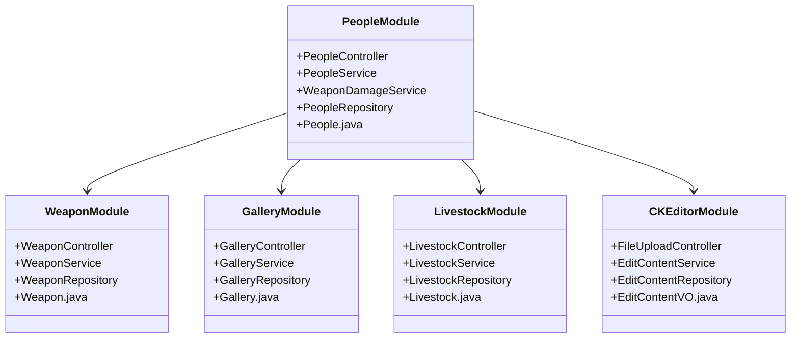
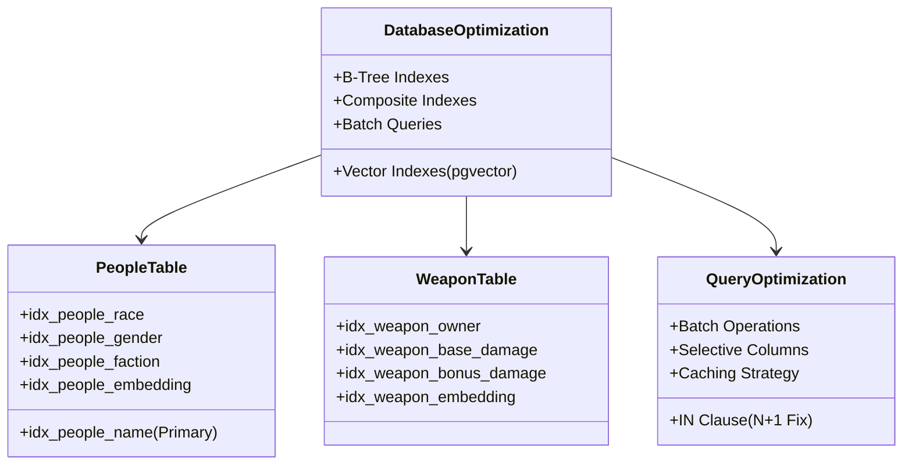
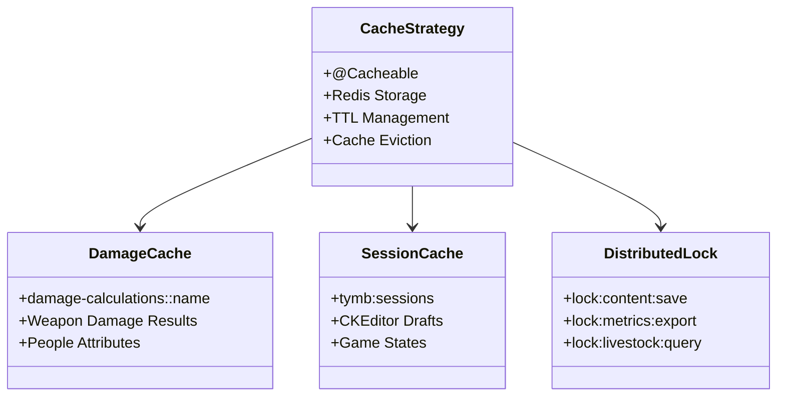
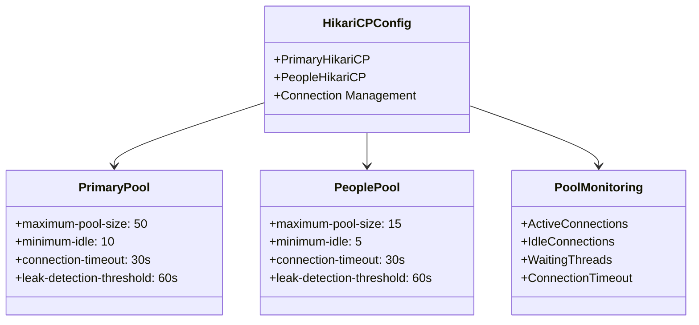
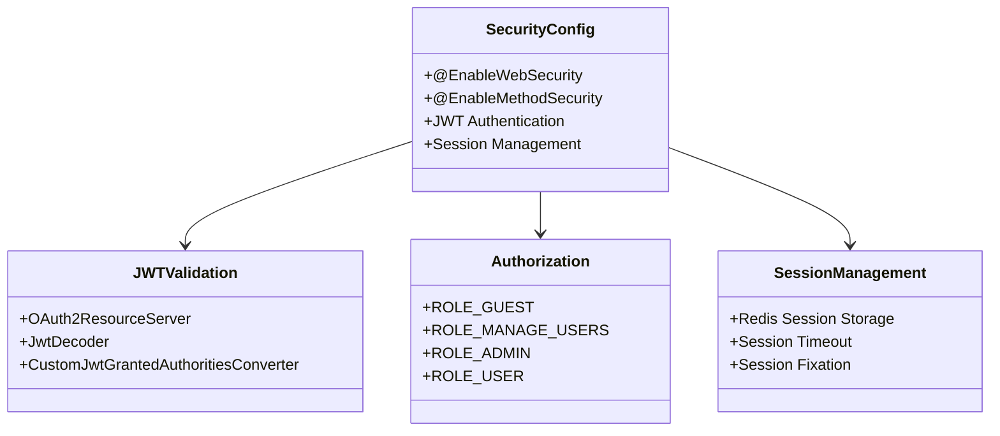
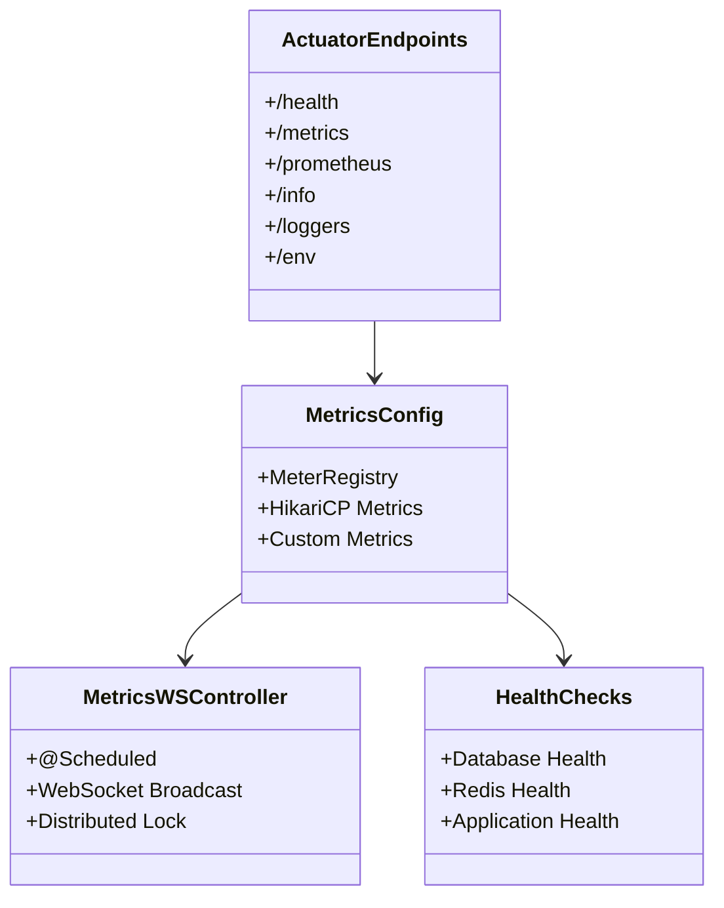
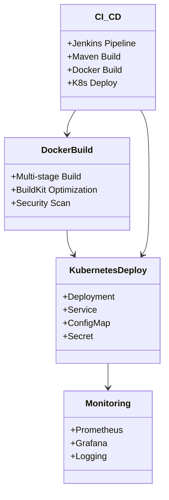
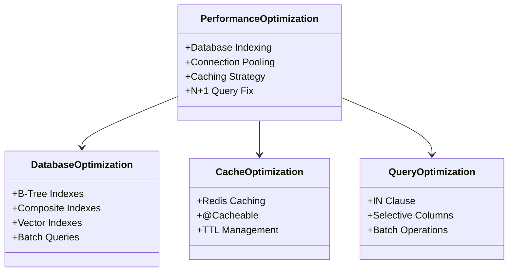

# TY-Multiverse-Backend
個人網站後端系統

## 架構設計

### 1. 核心架構

### 2. 模組架構

### 3. 資料庫優化架構

### 4. 快取架構

### 5. 連線池架構

### 6. 安全認證架構

### 7. 錯誤處理架構

### 8. 監控架構

### 9. 部署架構

### 10. 效能優化架構

## 文檔與工具

### Swagger UI
- 本地環境：`http://localhost:8080/tymb/swagger-ui/index.html#/`
- 生產環境：`https://peoplesystem.tatdvsonorth.com/tymb/swagger-ui/index.html#/`

### JavaDoc 文檔
- 本地環境：`http://localhost:8080/tymb/javadoc/index.html`
- 生產環境：`https://peoplesystem.tatdvsonorth.com/tymb/javadoc/index.html`

### Docker 建置
- 建置指令：`docker build -t papakao/ty-multiverse-backend:latest .`
- 多平台建置：`docker buildx build --platform linux/arm64 -t papakao/ty-multiverse-backend:latest --push .`
