# TY-Multiverse-Backend
這是我的個人網站的 Backend。

## 架構設計

### 1. 核心架構
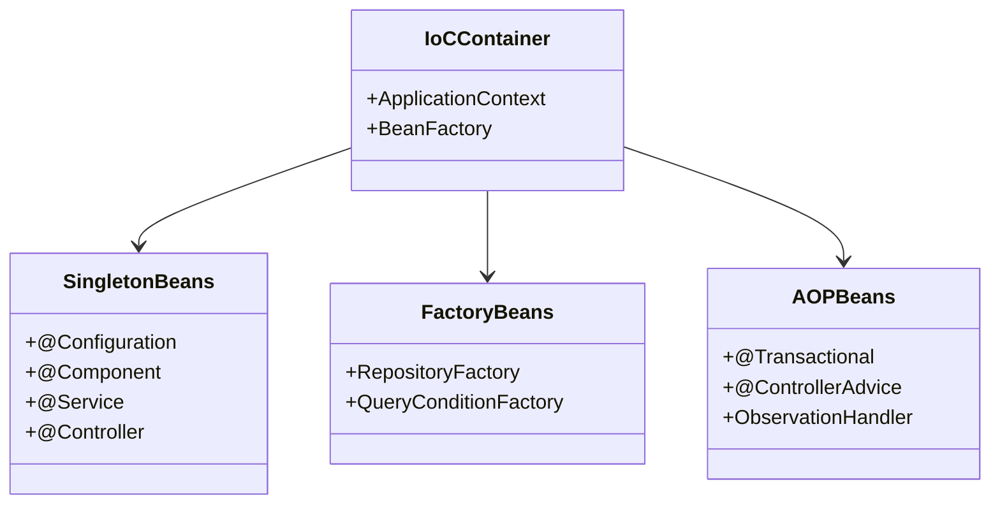

### 2. 設計模式與工廠架構

#### 2.1 Singleton 模式
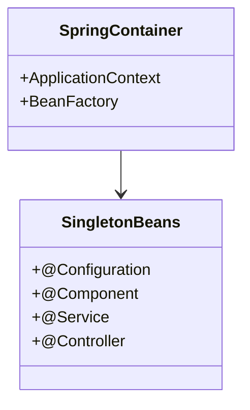

- **目的**: 確保系統資源的唯一性和一致性
- **應用**: 配置類、服務類、控制器等核心組件
- **優點**: 資源共享、狀態一致性、內存優化

#### 2.2 Factory 模式
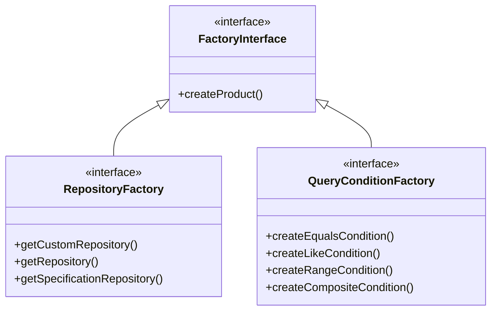

- **目的**: 提供統一的對象創建接口
- **應用**: Repository工廠、查詢條件工廠
- **優點**: 解耦對象創建、統一管理實例、支持擴展

#### 2.3 工廠方法實現
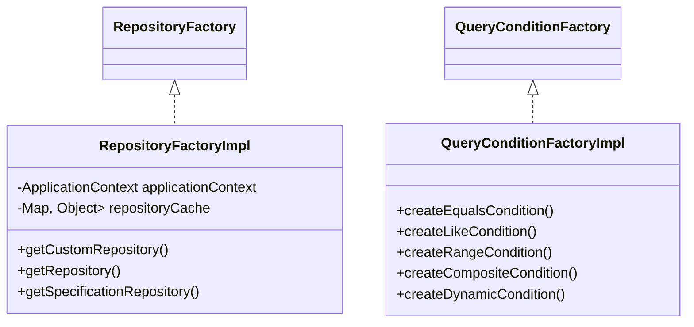

#### 2.4 工作原理
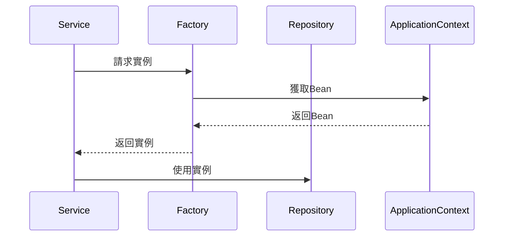

- **註冊流程**: Spring容器掃描並註冊工廠Bean
- **實例化**: 按需創建並緩存實例
- **依賴注入**: 通過構造器注入工廠實例
- **使用方式**: 服務層通過工廠獲取所需實例

### 3. IoC/AOP 架構

#### 3.1 IoC 容器
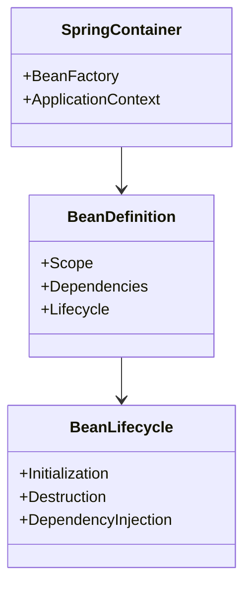

#### 3.2 AOP 切面
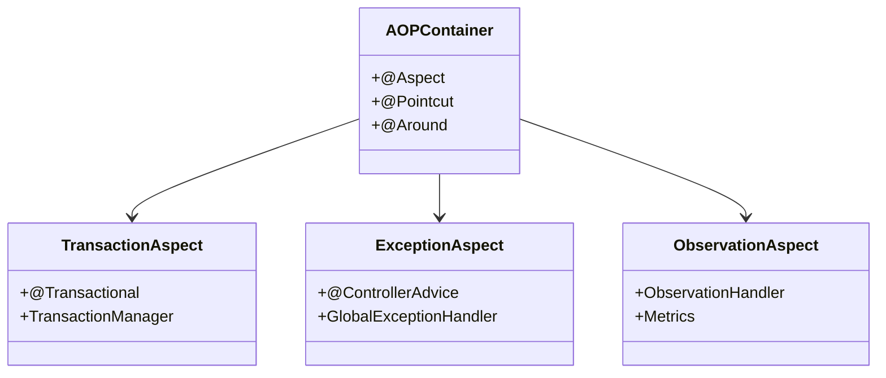

### 4. 架構優勢

1. **解耦與內聚**
   - IoC 實現依賴反轉
   - AOP 處理橫切關注點
   - 工廠模式管理對象創建

2. **可維護性**
   - 清晰的職責分離
   - 統一的異常處理
   - 集中的配置管理

3. **可擴展性**
   - 模塊化設計
   - 接口導向
   - 鬆散耦合

4. **性能優化**
   - 單例資源共享
   - 工廠對象緩存
   - AOP 性能監控

## 錯誤處理架構

### 1. 錯誤處理架構圖
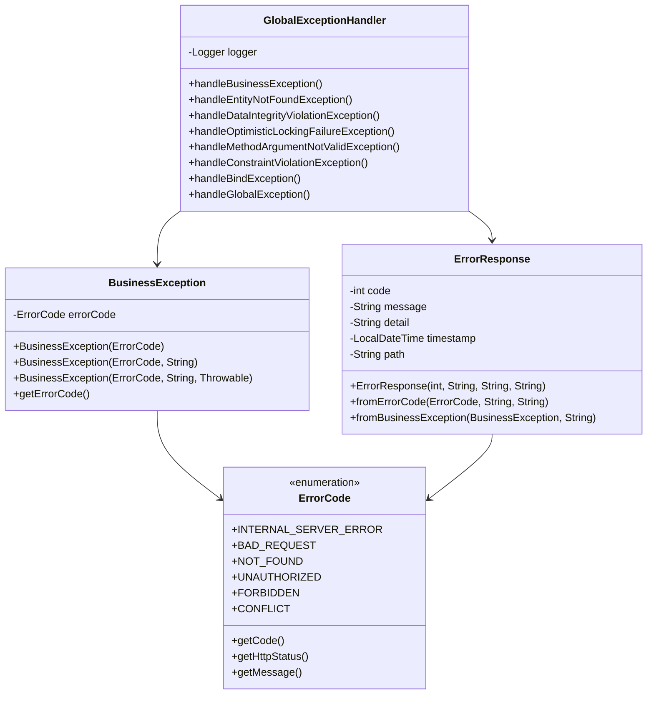

### 2. 模組特定異常
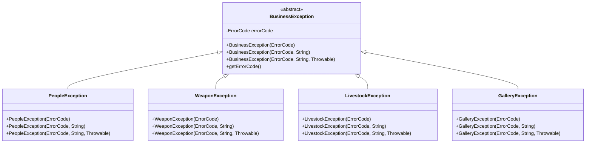

### 3. 錯誤處理流程
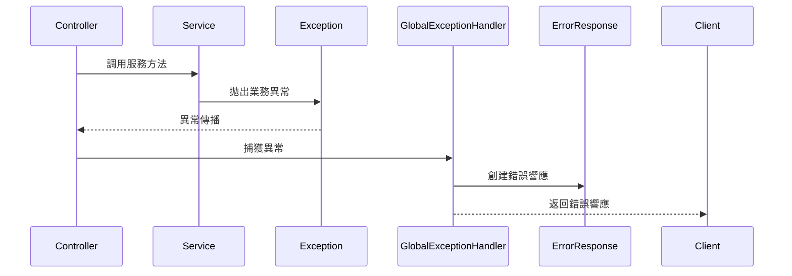

### 4. 錯誤處理優點

1. **統一錯誤格式**
   - 所有錯誤響應格式一致
   - 前端可以統一處理

2. **標準化錯誤碼**
   - 使用標準 HTTP 狀態碼

3. **詳細錯誤信息**
   - 包含錯誤代碼、消息和詳情
   - 記錄錯誤發生時間和路徑

4. **模組化設計**
   - 每個模組有自己的異常類

## 監控與健康檢查

### 1. Actuator 端點

應用程式提供了以下 Actuator 端點用於監控：

#### 1.1 健康檢查
```
GET https://***/tymb/actuator/health
```
提供應用程式的健康狀態，包括：
- 應用程式狀態
- 資料庫連接狀態
- 磁碟空間
- 其他組件狀態

#### 1.2 指標信息
```
GET https://***/tymb/actuator/metrics
```
提供所有可用的指標列表，包括：
- JVM 指標
- 系統指標
- 應用程式指標
- 自定義指標

#### 1.3 HikariCP 連接池指標
```
GET https://***/tymb/actuator/metrics/hikaricp.connections
GET https://***/tymb/actuator/metrics/hikaricp.connections.active
GET https://***/tymb/actuator/metrics/hikaricp.connections.idle
GET https://***/tymb/actuator/metrics/hikaricp.connections.pending
```
提供連接池的詳細狀態：
- 活動連接數
- 空閒連接數
- 等待連接數
- 連接獲取時間
- 連接使用時間
- 連接泄漏檢測

#### 1.4 Prometheus 格式指標
```
GET https://***/tymb/actuator/prometheus
```
提供 Prometheus 格式的指標數據，可用於：
- 指標收集
- 監控面板
- 警報設置

### 2. 監控架構
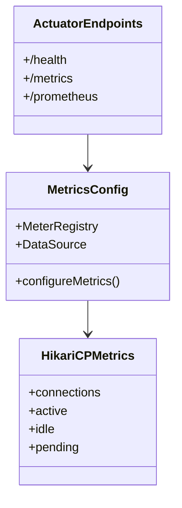

### 3. 監控指標說明

#### 3.1 系統指標
- CPU 使用率
- 記憶體使用情況
- 磁碟空間
- 線程狀態

#### 3.2 應用程式指標
- HTTP 請求統計
- 響應時間
- 錯誤率
- 業務邏輯執行時間

#### 3.3 資料庫指標
- 連接池狀態
- 查詢執行時間
- 事務統計
- 連接泄漏檢測

### 4. 使用建議

1. **健康檢查**
   - 定期檢查應用程式健康狀態
   - 設置自動化監控
   - 配置警報閾值

2. **性能監控**
   - 監控關鍵指標
   - 分析性能瓶頸
   - 優化資源使用

3. **問題診斷**
   - 使用指標追蹤問題
   - 分析錯誤模式
   - 預防系統故障

## swagger ui

```bash
http://localhost:8080/tymb/swagger-ui/index.html#/
https://peoplesystem.tatdvsonorth.com/tymb/swagger-ui/index.html#/
```

## image 建置

```bash
mvn clean package -DskipTests
docker buildx build --platform linux/arm64 -t papakao/ty-multiverse-backend:latest --push .
mvn -P platform install
docker build -t papakao/ty-multiverse-backend:latest .
docker push papakao/ty-multiverse-backend:latest

mvn -P platform install
docker buildx build --platform linux/arm64 -t papakao/ty-multiverse-backend:latest --push .
docker push papakao/ty-multiverse-backend:latest


mvn -P platform install
docker build -t ty-multiverse-backend .
docker run -d --name ty-multiverse-backend `
  -e "SPRING_PROFILES_ACTIVE=platform" `
  -e "URL_BACKEND=http://localhost:8080/tymb" `
  -e "SPRING_DATASOURCE_URL=jdbc:postgresql://*****:****/peoplesystem" `
  -e "SPRING_DATASOURCE_USERNAME=w*****o" `
  -e "SPRING_DATASOURCE_PASSWORD=W*****=" `
  -p 8080:8080 `
  ty-multiverse-backend
```

### 3. 並發控制

#### 3.1 樂觀鎖定
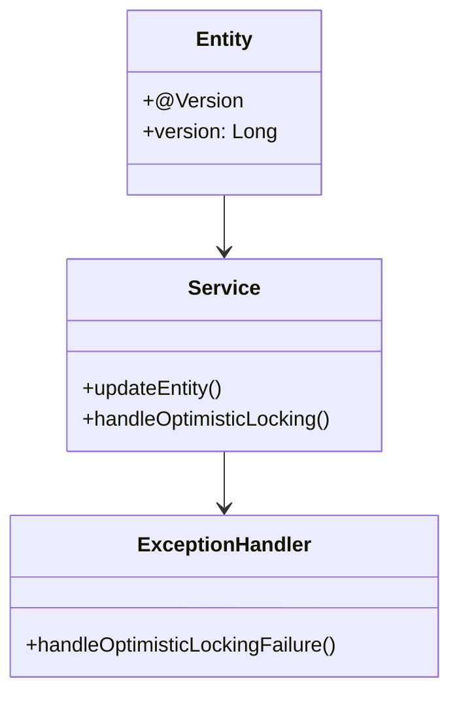

#### 3.2 樂觀鎖定機制
- **實現方式**: 使用 `@Version` 註解
- **觸發時機**: 並發更新衝突
- **處理策略**: 
  - 自動重試
  - 返回衝突狀態
  - 提示用戶刷新