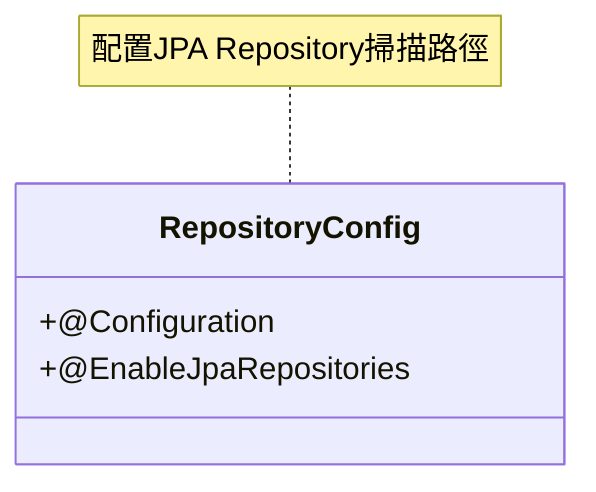
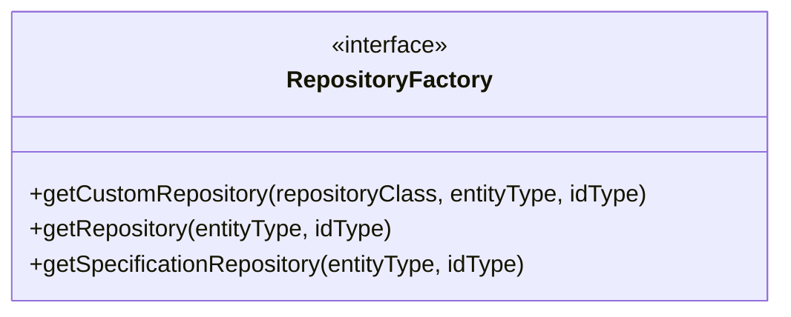
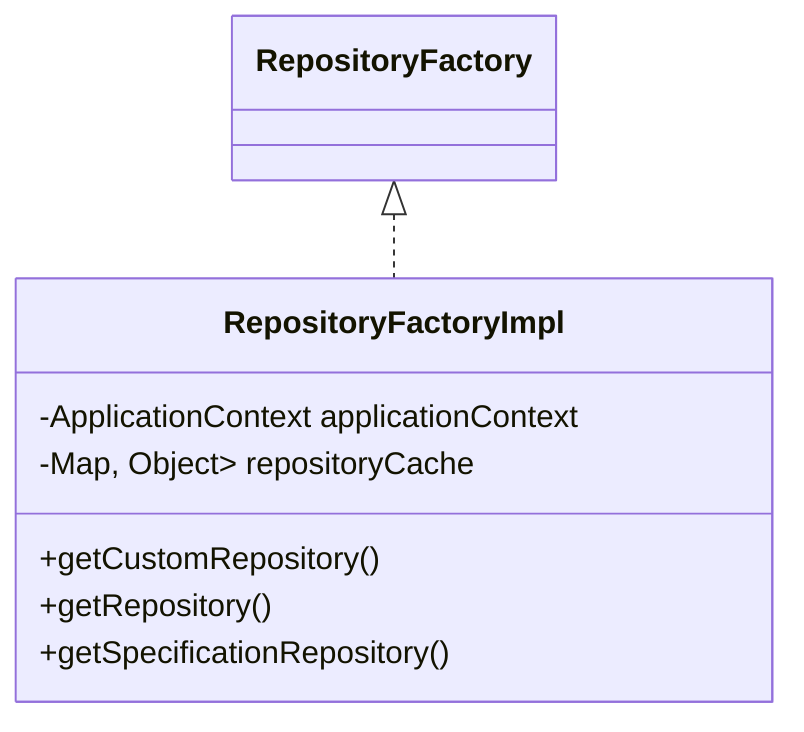
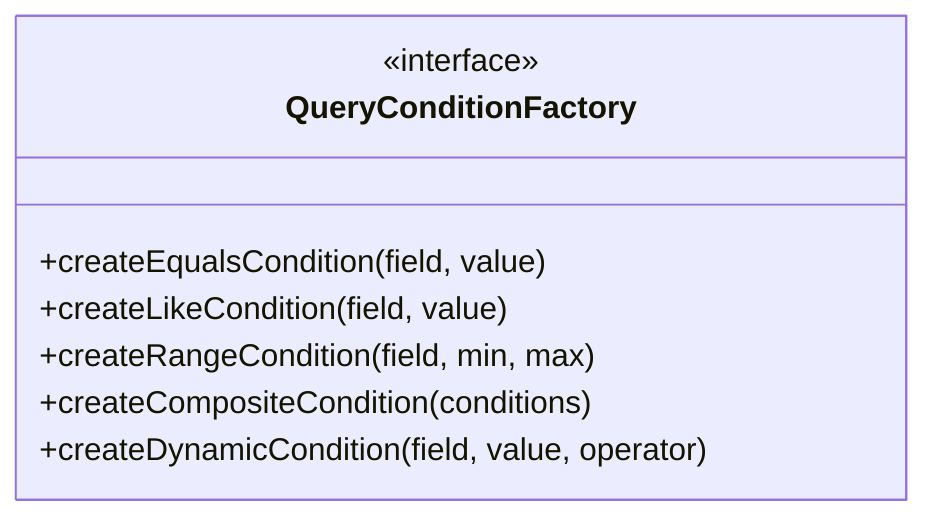
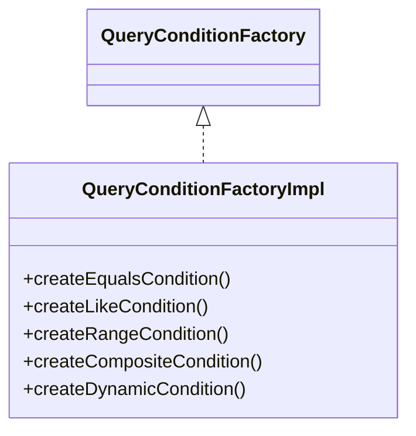
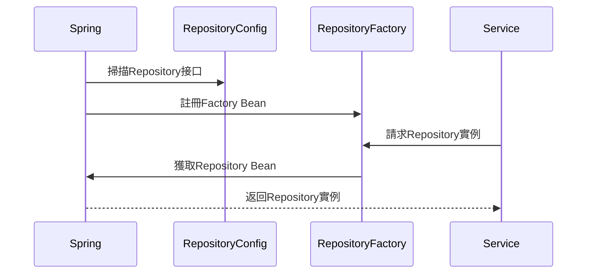
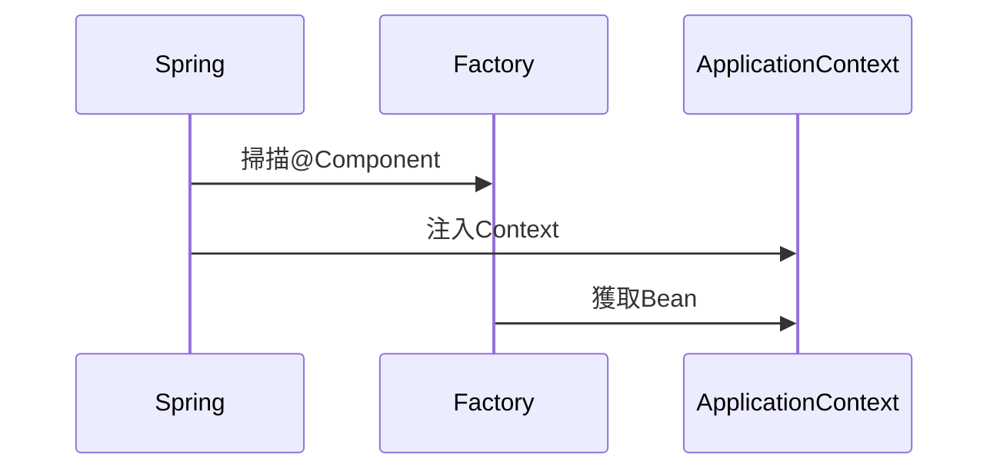
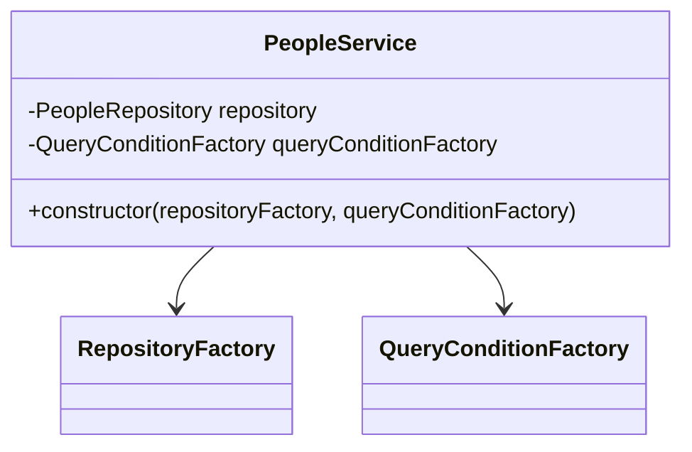
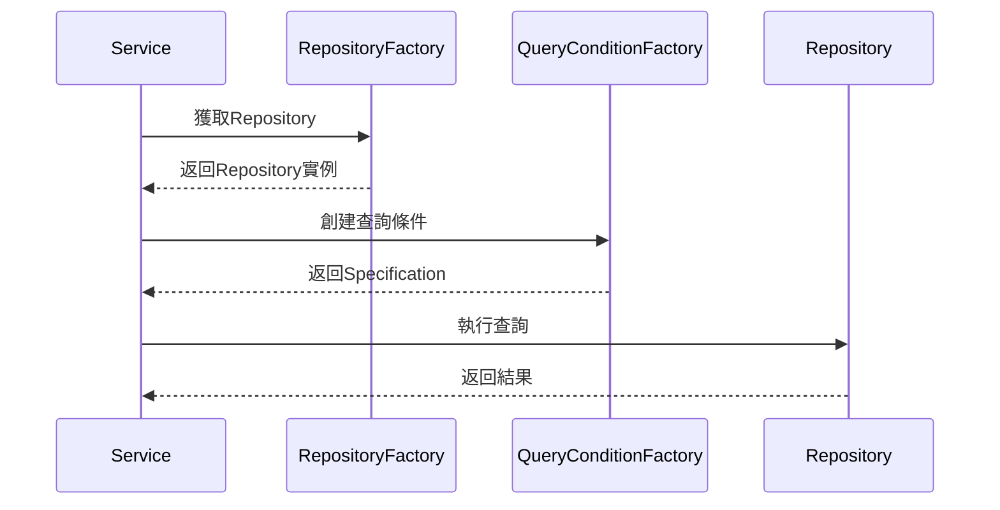

# TY-Multiverse-Backend
這是我的個人網站的 Backend。

## 工廠方法架構

### 1. Repository 工廠模式

#### 1.1 配置


#### 1.2 工廠接口


#### 1.3 工廠實現


### 2. 查詢條件工廠模式

#### 2.1 工廠接口


#### 2.2 工廠實現


### 3. 工作原理

#### 3.1 Repository 註冊流程


#### 3.2 Factory 註冊流程


#### 3.3 Service 使用流程


### 4. 設計優點

1. **依賴注入**
   - 所有組件都由 Spring 管理
   - 降低組件間耦合度
   - 便於單元測試

2. **類型安全**
   - 編譯時類型檢查
   - 避免運行時類型錯誤
   - 更好的 IDE 支持

3. **緩存機制**
   - 避免重複創建實例
   - 提高性能
   - 節省資源

### 5. 使用示例


## swagger ui

```bash
http://localhost:8080/tymb/swagger-ui/index.html#/
https://peoplesystem.tatdvsonorth.com/tymb/swagger-ui/index.html#/
```

## image 建置

```bash
mvn clean package -DskipTests
docker buildx build --platform linux/arm64 -t papakao/ty-multiverse-backend:latest --push .
mvn -P platform install
docker build -t papakao/ty-multiverse-backend:latest .
docker push papakao/ty-multiverse-backend:latest


mvn -P platform install
docker build -t ty-multiverse-backend .
docker run -d --name ty-multiverse-backend `
  -e "SPRING_PROFILES_ACTIVE=platform" `
  -e "URL_BACKEND=http://localhost:8080/tymb" `
  -e "SPRING_DATASOURCE_URL=jdbc:postgresql://*****:****/peoplesystem" `
  -e "SPRING_DATASOURCE_USERNAME=w*****o" `
  -e "SPRING_DATASOURCE_PASSWORD=W*****=" `
  -p 8080:8080 `
  ty-multiverse-backend

```