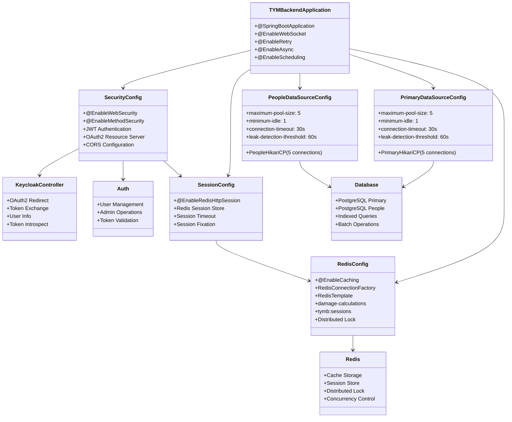
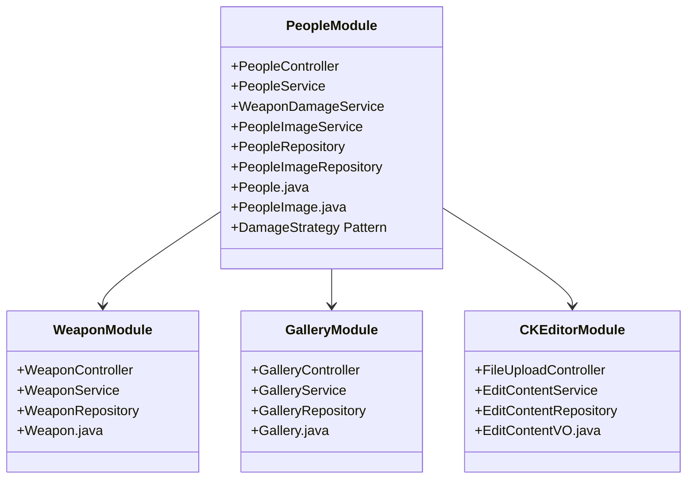
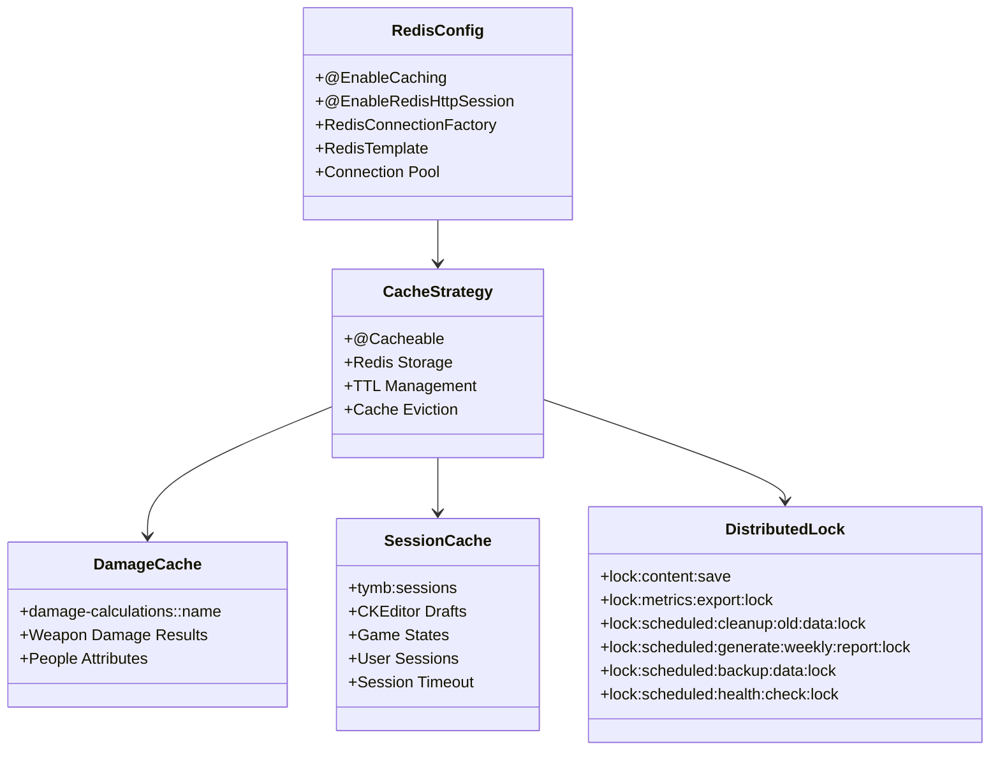
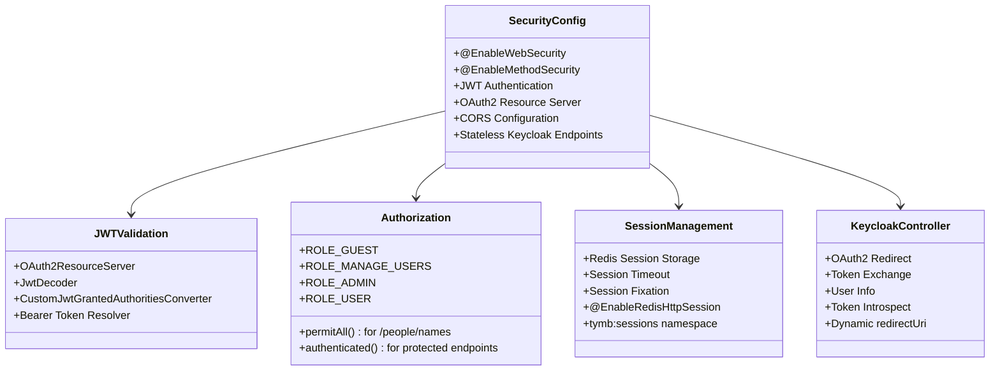
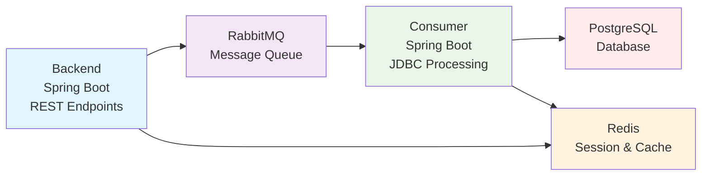

# TY Multiverse Backend

  

> The core backend system for the TY Multiverse ecosystem, powering data optimization, caching, and robust business logic.

## Table of Contents

- [Architecture](#architecture)
- [Design Patterns](#design-patterns)
- [Other](#other)

## Architecture

### 🛡️ Middleware/Filter 架構設計

在現代 Web 應用中，Middleware 允許我們在請求的各個階段插入橫切關注點，而無需修改核心業務代碼。

**核心原理：**
- **請求生命週期**：HTTP請求 → Tomcat → Filter鏈 → Spring MVC → Interceptor鏈 → Controller
- **責任鏈模式**：每個中間件都可以處理請求、傳遞控制權，或終止請求
- **AOP概念**：在不修改原始代碼的情況下添加額外功能

#### 中間件選擇指南

| 需求場景 | 推薦方案 | 理由 |
|---------|----------|------|
| 🔐 **身份認證** | Filter | 在業務邏輯前就攔截無效請求 |
| 📊 **日誌記錄** | Interceptor | 需要知道具體的 Controller 方法 |
| ⚡ **性能監控** | Aspect/Filter | 精確測量方法執行時間 |
| 🛡️ **統一錯誤處理** | @ControllerAdvice | 所有異常的集中處理點 |
| 🚦 **請求限流** | Filter/Aspect | 早期拒絕過多請求，節省資源 |

### Architecture Design

#### 1. Core Architecture

```mermaid
classDiagram
    %% Application Layer
    class TYMBackendApplication {
        +@SpringBootApplication
        +@EnableWebSocket
        +@EnableRetry
        +@EnableAsync
        +@EnableScheduling
    }
    
    %% Security Layer
    class SecurityConfig {
        +@EnableWebSecurity
        +@EnableMethodSecurity
        +JWT Authentication
        +OAuth2 Resource Server
        +CORS Configuration
    }
    
    class KeycloakController {
        +OAuth2 Redirect
        +Token Exchange
        +User Info
        +Token Introspect
    }
    
    class Auth {
        +User Management
        +Admin Operations
        +Token Validation
    }
    
    %% Configuration Layer
    class RedisConfig {
        +@EnableCaching
        +RedisConnectionFactory
        +RedisTemplate
        +damage-calculations
        +tymb:sessions
        +Distributed Lock
    }
    
    class PrimaryDataSourceConfig {
        +PrimaryHikariCP (5 connections)
        +maximum-pool-size: 5
        +minimum-idle: 1
        +connection-timeout: 30s
        +leak-detection-threshold: 60s
    }
    
    class PeopleDataSourceConfig {
        +PeopleHikariCP (5 connections)
        +maximum-pool-size: 5
        +minimum-idle: 1
        +connection-timeout: 30s
        +leak-detection-threshold: 60s
    }
    
    class SessionConfig {
        +@EnableRedisHttpSession
        +Redis Session Store
        +Session Timeout
        +Session Fixation
    }
    
    %% Infrastructure Layer
    class Database {
        +PostgreSQL Primary
        +PostgreSQL People
        +Indexed Queries
        +Batch Operations
    }
    
    class Redis {
        +Cache Storage
        +Session Store
        +Distributed Lock
        +Concurrency Control
    }
    
    %% Layer Relationships
    TYMBackendApplication --> SecurityConfig
    TYMBackendApplication --> RedisConfig
    TYMBackendApplication --> PrimaryDataSourceConfig
    TYMBackendApplication --> PeopleDataSourceConfig
    TYMBackendApplication --> SessionConfig
    
    SecurityConfig --> KeycloakController
    SecurityConfig --> Auth
    SecurityConfig --> SessionConfig
    
    SessionConfig --> RedisConfig
    RedisConfig --> Redis
    
    PrimaryDataSourceConfig --> Database
    PeopleDataSourceConfig --> Database
```

#### 2. Module Architecture

```mermaid
classDiagram
    class PeopleModule {
        +PeopleController
        +PeopleService
        +WeaponDamageService
        +PeopleImageService
        +PeopleRepository
        +PeopleImageRepository
        +People.java
        +PeopleImage.java
        +DamageStrategy Pattern
    }
    
    class WeaponModule {
        +WeaponController
        +WeaponService
        +WeaponRepository
        +Weapon.java
    }
    
    class GalleryModule {
        +GalleryController
        +GalleryService
        +GalleryRepository
        +Gallery.java
    }
    
    class CKEditorModule {
        +FileUploadController
        +EditContentService
        +EditContentRepository
        +EditContentVO.java
    }
    
    %% Module Dependencies
    PeopleModule --> WeaponModule
    PeopleModule --> GalleryModule
    PeopleModule --> CKEditorModule
```

#### 3. Cache Architecture

```mermaid
classDiagram
    class RedisConfig {
        +@EnableCaching
        +@EnableRedisHttpSession
        +RedisConnectionFactory
        +RedisTemplate
        +Connection Pool
    }
    
    class CacheStrategy {
        +@Cacheable
        +Redis Storage
        +TTL Management
        +Cache Eviction
    }
    
    class DamageCache {
        +damage-calculations::name
        +Weapon Damage Results
        +People Attributes
    }
    
    class SessionCache {
        +tymb:sessions
        +CKEditor Drafts
        +Game States
        +User Sessions
        +Session Timeout
    }
    
    class DistributedLock {
        +lock:content:save
        +lock:metrics:export:lock
        +lock:scheduled:cleanup:old:data:lock
        +lock:scheduled:generate:weekly:report:lock
        +lock:scheduled:backup:data:lock
        +lock:scheduled:health:check:lock
    }
    
    RedisConfig --> CacheStrategy
    CacheStrategy --> DamageCache
    CacheStrategy --> SessionCache
    CacheStrategy --> DistributedLock
```

#### 4. Security Authentication Architecture

```mermaid
classDiagram
    class SecurityConfig {
        +@EnableWebSecurity
        +@EnableMethodSecurity
        +JWT Authentication
        +OAuth2 Resource Server
        +CORS Configuration
        +Stateless Keycloak Endpoints
    }
    
    class JWTValidation {
        +OAuth2ResourceServer
        +JwtDecoder
        +CustomJwtGrantedAuthoritiesConverter
        +Bearer Token Resolver
    }
    
    class Authorization {
        +ROLE_GUEST
        +ROLE_MANAGE_USERS
        +ROLE_ADMIN
        +ROLE_USER
        +permitAll() for /people/names
        +authenticated() for protected endpoints
    }
    
    class SessionManagement {
        +Redis Session Storage
        +Session Timeout
        +Session Fixation
        +@EnableRedisHttpSession
        +tymb:sessions namespace
    }
    
    class KeycloakController {
        +OAuth2 Redirect
        +Token Exchange
        +User Info
        +Token Introspect
        +Dynamic redirectUri
    }
    
    SecurityConfig --> JWTValidation
    SecurityConfig --> Authorization
    SecurityConfig --> SessionManagement
    SecurityConfig --> KeycloakController
```

#### 5. RabbitMQ Data Flow Architecture

```mermaid
graph LR
    A[Backend<br/>Spring Boot<br/>REST Endpoints] --> B[RabbitMQ<br/>Message Queue]
    B --> C[Consumer<br/>Spring Boot<br/>JDBC Processing]
    C --> D[PostgreSQL<br/>Database]

    A --> E[Redis<br/>Session & Cache]
    C --> E

    classDef producer fill:#e1f5fe
    classDef mq fill:#f3e5f5
    classDef consumer fill:#e8f5e8
    classDef database fill:#ffebee
    classDef cache fill:#fff3e0

    class A producer
    class B mq
    class C consumer
    class D database
    class E cache
```

**架構說明：**
- **Backend (Producer)**: Spring Boot REST API，接收請求並發送訊息到 RabbitMQ
- **Consumer**: Spring Boot，使用 JDBC 處理訊息並將數據寫入 PostgreSQL
- **Redis**: 會話儲存、快取和分散式鎖，`tymb:sessions` 和 `damage-calculations` 命名空間
- **其他模組**: 使用 JWT 無狀態認證

### Keycloak TOTP 2FA（已部署）

Keycloak 26.1.4 已在 `peoplesystem.tatdvsonorth.com/sso` 啟用強制 TOTP 2FA。

- **Realm**: `master`（admin dashboard）+ `PeopleSystem`（API 用戶）
- **已強制 TOTP 用戶**: master: `admin`, `wavo`；PeopleSystem: `chiaki`, `sorane`
- **新用戶**: 設有 `defaultAction=CONFIGURE_TOTP`，首次登入自動要求設定

> kcadm 救援指令、Jenkins SSO 設定、詳細步驟請見 [peoplesystem-terraform-oke/AGENTS.md](../peoplesystem-terraform-oke/AGENTS.md)。

## Design Patterns

### 🎯 設計模式 (Design Patterns)

本專案主要採用以下設計模式來確保高內聚與低耦合分層架構：

- **依賴注入 (Dependency Injection)**: 透過 Spring IoC 容器管理組件生命週期與相依性。
- **策略模式 (Strategy Pattern)**: 實作於特定的業務邏輯（如 `DamageStrategy`），動態計算武器與角色傷害。
- **代理與切面模式 (Proxy / AOP)**: 實作分散式限流（`RateLimiterAspect`）與統一日誌處理，將橫切關注點自業務邏輯抽離。
- **責任鏈與過濾器模式 (Filter / Chain of Responsibility)**: 透過 Spring Security 驗證鏈與請求限流過濾器處理所有的進入請求。

## Other

### Documentation

- Local Swagger UI: `http://localhost:8080/tymb/swagger-ui/index.html`
- Production Swagger UI: `https://peoplesystem.tatdvsonorth.com/tymb/swagger-ui/index.html`
- Local JavaDoc: `http://localhost:8080/tymb/javadoc/index.html`
- Production JavaDoc: `https://peoplesystem.tatdvsonorth.com/tymb/javadoc/index.html`

> 啟動指令、Maven 指令、Docker 建置請見 [AGENTS.md](AGENTS.md)。
