# TY Multiverse Backend

  

> The core backend system for the TY Multiverse ecosystem, powering data optimization, caching, and robust business logic.

## Table of Contents

- [Install](#install)
- [Architecture](#architecture)
- [Design Patterns](#design-patterns)
- [Other](#other)

## Install

### 🔧 開發環境設定

#### 依賴管理架構

本專案使用 **統一的依賴管理架構**，透過 Maven 從本地或遠端倉庫引用共用程式庫 `ty-multiverse-common`。

##### 架構說明
- **統一 common 模組**：所有共用程式碼集中在單一專案中管理
- **自動依賴解析**：Maven 自動處理模組間的依賴關係
- **版本同步**：所有專案使用相同版本的 common 模組

##### 開發環境設定
```bash
## 確保 common 模組已建置並安裝到本地倉庫
cd ../ty-multiverse-common
mvn clean install

## 檢查依賴關係
mvn dependency:tree | grep ty-multiverse-common
```

##### Common 模組更新流程
```bash
## 1. 在 common 目錄中進行開發
cd ../ty-multiverse-common
git checkout -b feature/new-enhancement
## ... 修改程式碼 ...

## 2. 建置並安裝到本地倉庫
mvn clean install

## 3. 提交並推送變更
git add .
git commit -m "Add new enhancement"
git push origin feature/new-enhancement

## 4. 其他專案會自動使用更新後的版本
cd ../ty-multiverse-backend
mvn clean compile  # 自動使用新版本的 common
```

### 🚀 本地開發啟動

#### 啟動指令

##### 完整構建和啟動（推薦用於全新專案或清理後）

```bash
## 方法 1：正確的編譯指令（推薦）
mvn clean generate-sources compile
mvn spring-boot:run

## 方法 2：一次性執行（包含編譯和運行）
mvn clean generate-sources compile spring-boot:run
```

**📋 指令說明：**
- `clean` - 清空舊的編譯結果
- `generate-sources` - 生成 protobuf gRPC 類別
- `compile` - 編譯所有源代
- `spring-boot:run` - 啟動 Spring Boot 應用

##### 快速啟動（日常開發使用）

```bash
## 啟動後端服務
mvn spring-boot:run

## 或使用 Maven Wrapper
./mvnw spring-boot:run
```

**Maven vs Maven Wrapper：**
- `mvn`: 使用系統安裝的 Maven（需要手動安裝）
- `./mvnw`: Maven Wrapper，自動下載並使用專案指定的 Maven 版本（推薦）
- 功能相同，但 Maven Wrapper 確保團隊成員使用相同版本，避免版本衝突

**服務器啟動資訊：**
- **HTTP API**: `http://localhost:8080/tymb`
- **Swagger UI**: `http://localhost:8080/tymb/swagger-ui/index.html`
- **JavaDoc**: `http://localhost:8080/tymb/javadoc/index.html`

**注意事項：**
- 確保 PostgreSQL 和 Redis 服務正在運行
- 查看啟動日誌確認服務狀態

**備註：** 如需異步處理模式，可以參考 Consumer 項目的 README 配置 RabbitMQ。

## Architecture

### 🛡️ Middleware/Filter 架構設計

#### 為什麼需要 Middleware？

在現代 Web 應用中，請求處理不應該只關注業務邏輯。Middleware（中間件）允許我們在請求的各個階段插入橫切關注點，而無需修改核心業務代碼。

**核心原理：**
- **請求生命週期**：HTTP請求 → Tomcat → Filter鏈 → Spring MVC → Interceptor鏈 → Controller
- **責任鏈模式**：每個中間件都可以處理請求、傳遞控制權，或終止請求
- **AOP概念**：在不修改原始代碼的情況下添加額外功能

#### Backend 中間件使用情況

##### 1. Servlet Filter 層級

**RequestConcurrencyLimiter** - 請求併發控制：
```java
@Component
public class RequestConcurrencyLimiter implements Filter {
    @Override
    public void doFilter(ServletRequest request, ServletResponse response, FilterChain chain) {
        // 實現請求併發限制邏輯
        // 防止過多併發請求影響系統穩定性
    }
}
```
- **位置**：Spring MVC 之前，最早的防線
- **職責**：控制請求併發數量，保護系統資源

##### 2. AOP Aspect 層級

**RateLimiterAspect** - 限流保護：
```java
@Aspect
@Component
public class RateLimiterAspect {
    @Around("@annotation(RateLimit)")
    public Object enforceRateLimit(ProceedingJoinPoint joinPoint) throws Throwable {
        // 實現基於 Redis 的分散式限流
        // 防止 API 濫用和惡意攻擊
    }
}
```
- **位置**：方法執行前攔截
- **職責**：API 調用頻率控制，防止服務過載

##### 3. Spring Security Filter 鏈

**JWT 認證過濾器**：
```java
@Configuration
@EnableWebSecurity
public class SecurityConfig {
    @Bean
    public SecurityFilterChain filterChain(HttpSecurity http) {
        http.addFilterBefore(jwtAuthenticationFilter(),
                           UsernamePasswordAuthenticationFilter.class);
    }
}
```
- **位置**：Security 過濾器鏈中
- **職責**：JWT Token 驗證，用戶身份認證

#### 中間件選擇指南

| 需求場景 | 推薦方案 | 理由 |
|---------|----------|------|
| 🔐 **身份認證** | Filter | 在業務邏輯前就攔截無效請求 |
| 📊 **日誌記錄** | Interceptor | 需要知道具體的 Controller 方法 |
| ⚡ **性能監控** | Aspect/Filter | 精確測量方法執行時間 |
| 🛡️ **統一錯誤處理** | @ControllerAdvice | 所有異常的集中處理點 |
| 🚦 **請求限流** | Filter/Aspect | 早期拒絕過多請求，節省資源 |

#### 架構優勢

1. **關注點分離**：業務邏輯與基礎設施邏輯完全解耦
2. **代碼重用**：通用功能（如認證、限流）可在多個服務間共享
3. **易於測試**：每個中間件都可以單獨測試
4. **易於維護**：修改中間件邏輯不會影響業務代碼
5. **性能優化**：可以在最早階段拒絕無效請求

#### 配置方式

```properties
## 中間件相關配置
app.middleware.concurrency.max-requests=100
app.middleware.rate-limit.enabled=true
app.middleware.rate-limit.requests-per-minute=60

## Spring Security 配置
spring.security.enabled=true
jwt.secret=your-secret-key
```

#### 監控與調試

- **日誌記錄**：每個中間件都應記錄關鍵操作
- **性能指標**：監控中間件處理時間和成功率
- **健康檢查**：確保中間件正常運行

**相關文件：**
- `src/main/java/tw/com/tymbackend/config/SecurityConfig.java`
- `src/main/java/tw/com/tymbackend/filter/RequestConcurrencyLimiter.java`
- `src/main/java/tw/com/tymbackend/aspect/RateLimiterAspect.java`

### Architecture Design

#### 1. Core Architecture
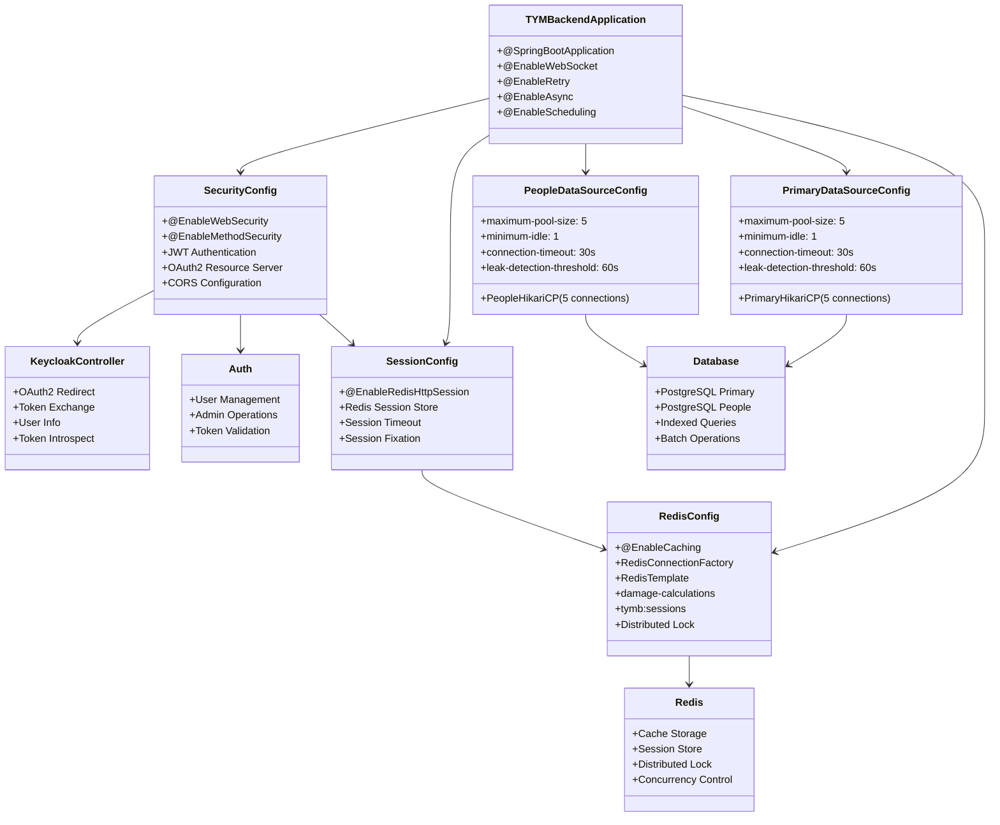
```mermaid
classDiagram
    %% Application Layer
    class TYMBackendApplication {
        +@SpringBootApplication
        +@EnableWebSocket
        +@EnableRetry
        +@EnableAsync
        +@EnableScheduling
    }
    
    %% Security Layer
    class SecurityConfig {
        +@EnableWebSecurity
        +@EnableMethodSecurity
        +JWT Authentication
        +OAuth2 Resource Server
        +CORS Configuration
    }
    
    class KeycloakController {
        +OAuth2 Redirect
        +Token Exchange
        +User Info
        +Token Introspect
    }
    
    class Auth {
        +User Management
        +Admin Operations
        +Token Validation
    }
    
    %% Configuration Layer
    class RedisConfig {
        +@EnableCaching
        +RedisConnectionFactory
        +RedisTemplate
        +damage-calculations
        +tymb:sessions
        +Distributed Lock
    }
    
    class PrimaryDataSourceConfig {
        +PrimaryHikariCP (5 connections)
        +maximum-pool-size: 5
        +minimum-idle: 1
        +connection-timeout: 30s
        +leak-detection-threshold: 60s
    }
    
    class PeopleDataSourceConfig {
        +PeopleHikariCP (5 connections)
        +maximum-pool-size: 5
        +minimum-idle: 1
        +connection-timeout: 30s
        +leak-detection-threshold: 60s
    }
    
    class SessionConfig {
        +@EnableRedisHttpSession
        +Redis Session Store
        +Session Timeout
        +Session Fixation
    }
    
    %% Infrastructure Layer
    class Database {
        +PostgreSQL Primary
        +PostgreSQL People
        +Indexed Queries
        +Batch Operations
    }
    
    class Redis {
        +Cache Storage
        +Session Store
        +Distributed Lock
        +Concurrency Control
    }
    
    %% Layer Relationships
    TYMBackendApplication --> SecurityConfig
    TYMBackendApplication --> RedisConfig
    TYMBackendApplication --> PrimaryDataSourceConfig
    TYMBackendApplication --> PeopleDataSourceConfig
    TYMBackendApplication --> SessionConfig
    
    SecurityConfig --> KeycloakController
    SecurityConfig --> Auth
    SecurityConfig --> SessionConfig
    
    SessionConfig --> RedisConfig
    RedisConfig --> Redis
    
    PrimaryDataSourceConfig --> Database
    PeopleDataSourceConfig --> Database
```

#### 2. Module Architecture
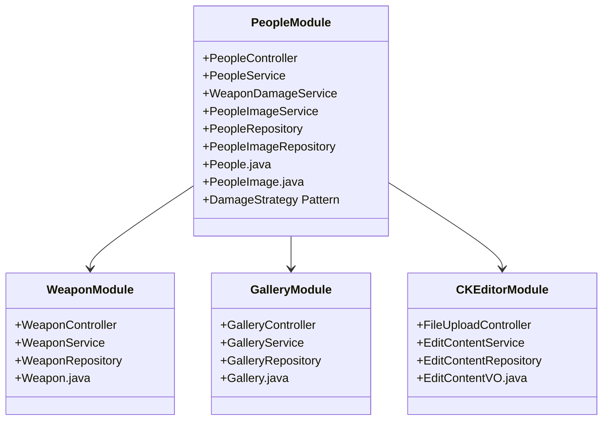
```mermaid
classDiagram
    class PeopleModule {
        +PeopleController
        +PeopleService
        +WeaponDamageService
        +PeopleImageService
        +PeopleRepository
        +PeopleImageRepository
        +People.java
        +PeopleImage.java
        +DamageStrategy Pattern
    }
    
    class WeaponModule {
        +WeaponController
        +WeaponService
        +WeaponRepository
        +Weapon.java
    }
    
    class GalleryModule {
        +GalleryController
        +GalleryService
        +GalleryRepository
        +Gallery.java
    }
    
    class CKEditorModule {
        +FileUploadController
        +EditContentService
        +EditContentRepository
        +EditContentVO.java
    }
  
    
    %% Module Dependencies
    PeopleModule --> WeaponModule
    PeopleModule --> GalleryModule
    PeopleModule --> CKEditorModule
```

#### 3. Database Optimization Architecture
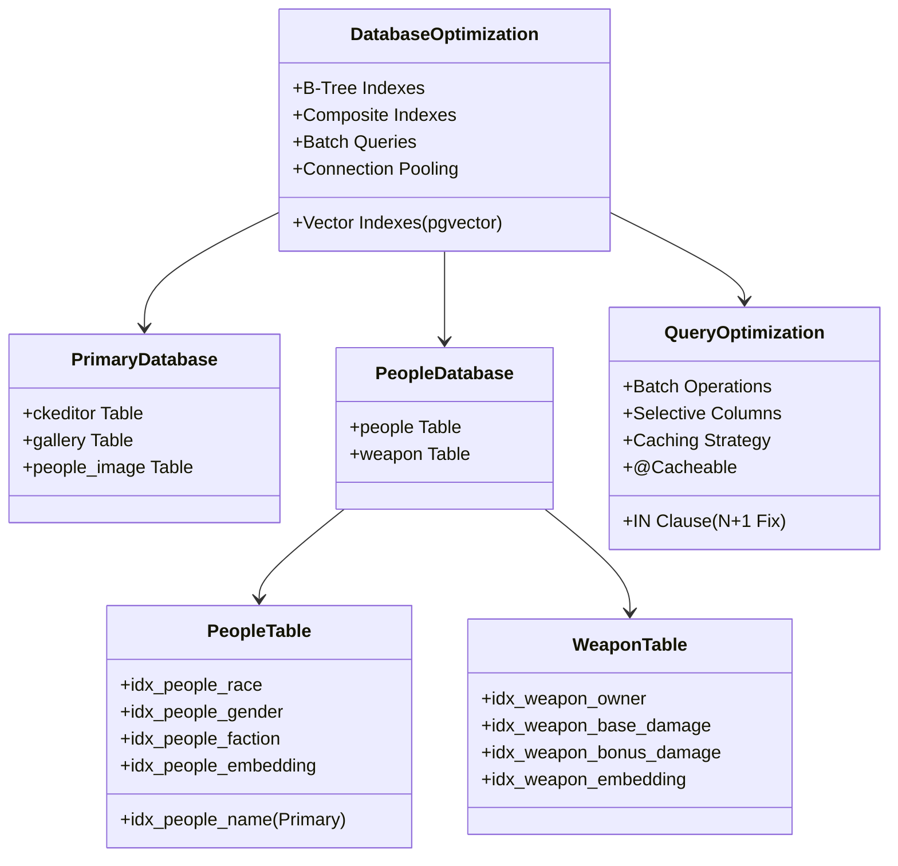
```mermaid
classDiagram
    class DatabaseOptimization {
        +B-Tree Indexes
        +Composite Indexes
        +Vector Indexes (pgvector)
        +Batch Queries
        +Connection Pooling
    }
    
    class PrimaryDatabase {
        +ckeditor Table
        +gallery Table
        +people_image Table
    }
    
    class PeopleDatabase {
        +people Table
        +weapon Table
    }
    
    class PeopleTable {
        +idx_people_name (Primary)
        +idx_people_race
        +idx_people_gender
        +idx_people_faction
        +idx_people_embedding
    }
    
    class WeaponTable {
        +idx_weapon_owner
        +idx_weapon_base_damage
        +idx_weapon_bonus_damage
        +idx_weapon_embedding
    }
    
    class QueryOptimization {
        +IN Clause (N+1 Fix)
        +Batch Operations
        +Selective Columns
        +Caching Strategy
        +@Cacheable
    }
    
    DatabaseOptimization --> PrimaryDatabase
    DatabaseOptimization --> PeopleDatabase
    PeopleDatabase --> PeopleTable
    PeopleDatabase --> WeaponTable
    DatabaseOptimization --> QueryOptimization
```

#### 4. Cache Architecture
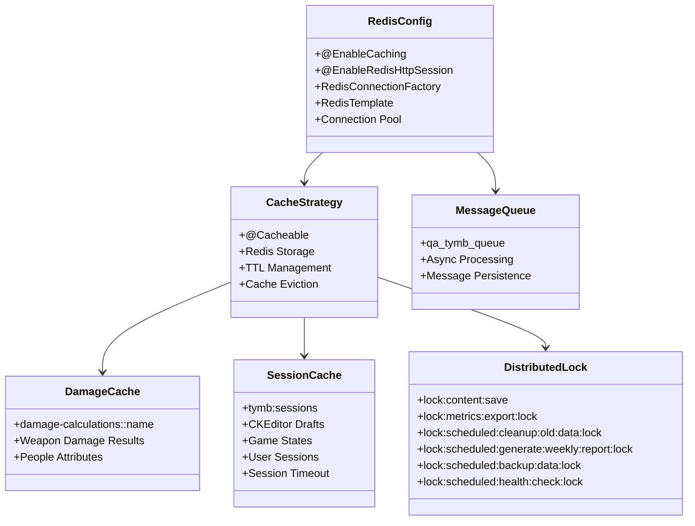
```mermaid
classDiagram
    class RedisConfig {
        +@EnableCaching
        +@EnableRedisHttpSession
        +RedisConnectionFactory
        +RedisTemplate
        +Connection Pool
    }
    
    class CacheStrategy {
        +@Cacheable
        +Redis Storage
        +TTL Management
        +Cache Eviction
    }
    
    class DamageCache {
        +damage-calculations::name
        +Weapon Damage Results
        +People Attributes
    }
    
    class SessionCache {
        +tymb:sessions
        +CKEditor Drafts
        +Game States
        +User Sessions
        +Session Timeout
    }
    
    class DistributedLock {
        +lock:content:save
        +lock:metrics:export:lock
        +lock:scheduled:cleanup:old:data:lock
        +lock:scheduled:generate:weekly:report:lock
        +lock:scheduled:backup:data:lock
        +lock:scheduled:health:check:lock
    }
    
    class MessageQueue {
        +qa_tymb_queue
        +Async Processing
        +Message Persistence
    }
    
    RedisConfig --> CacheStrategy
    CacheStrategy --> DamageCache
    CacheStrategy --> SessionCache
    CacheStrategy --> DistributedLock
    RedisConfig --> MessageQueue
```
#### 4.2. Lua Script Flow
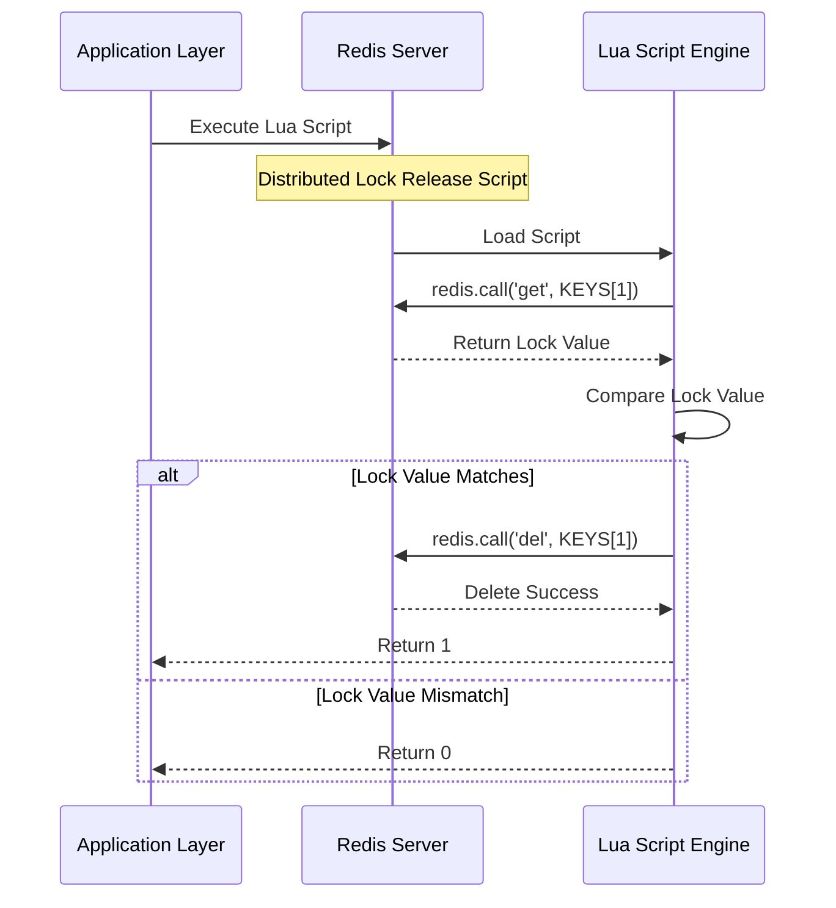
```mermaid
sequenceDiagram
    participant App as Application Layer
    participant Redis as Redis Server
    participant Lua as Lua Script Engine
    
    App->>Redis: Execute Lua Script
    Note over Redis: Distributed Lock Release Script
    Redis->>Lua: Load Script
    Lua->>Redis: redis.call('get', KEYS[1])
    Redis-->>Lua: Return Lock Value
    Lua->>Lua: Compare Lock Value
    alt Lock Value Matches
        Lua->>Redis: redis.call('del', KEYS[1])
        Redis-->>Lua: Delete Success
        Lua-->>App: Return 1
    else Lock Value Mismatch
        Lua-->>App: Return 0
    end
```

#### 4.2.1. Distributed Lock Usage Scenario
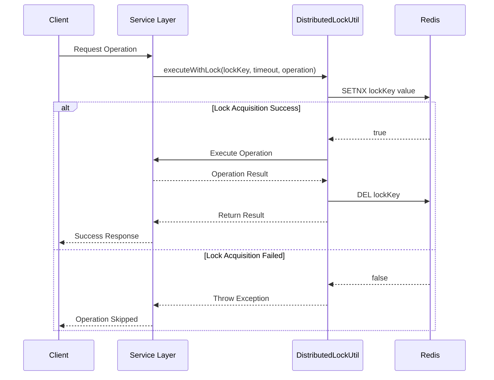
```mermaid
sequenceDiagram
    participant Client as Client
    participant Service as Service Layer
    participant LockUtil as DistributedLockUtil
    participant Redis as Redis
    
    Client->>Service: Request Operation
    Service->>LockUtil: executeWithLock(lockKey, timeout, operation)
    LockUtil->>Redis: SETNX lockKey value
    alt Lock Acquisition Success
        Redis-->>LockUtil: true
        LockUtil->>Service: Execute Operation
        Service-->>LockUtil: Operation Result
        LockUtil->>Redis: DEL lockKey
        LockUtil-->>Service: Return Result
        Service-->>Client: Success Response
    else Lock Acquisition Failed
        Redis-->>LockUtil: false
        LockUtil-->>Service: Throw Exception
        Service-->>Client: Operation Skipped
    end
```

#### 5. Connection Pool Architecture
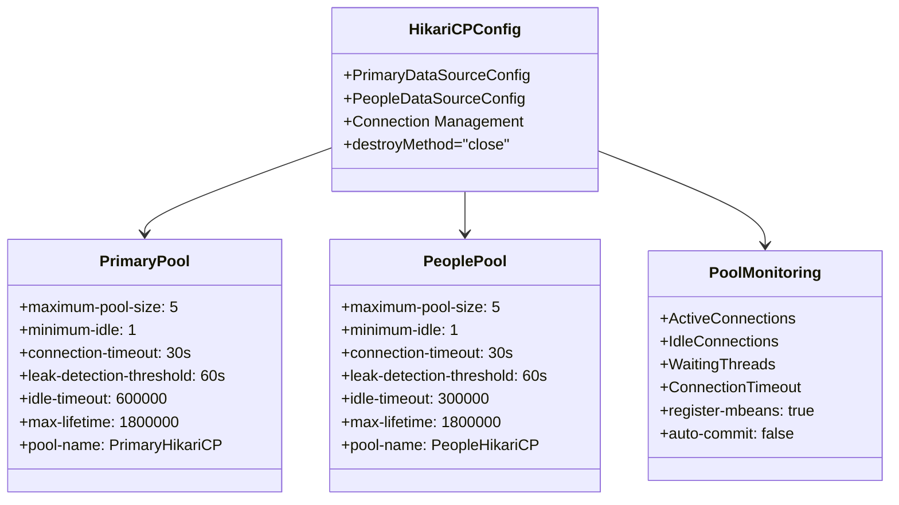
```mermaid
classDiagram
    class HikariCPConfig {
        +PrimaryDataSourceConfig
        +PeopleDataSourceConfig
        +Connection Management
        +destroyMethod="close"
    }
    
    class PrimaryPool {
        +maximum-pool-size: 5
        +minimum-idle: 1
        +connection-timeout: 30s
        +leak-detection-threshold: 60s
        +idle-timeout: 600000
        +max-lifetime: 1800000
        +pool-name: PrimaryHikariCP
    }
    
    class PeoplePool {
        +maximum-pool-size: 5
        +minimum-idle: 1
        +connection-timeout: 30s
        +leak-detection-threshold: 60s
        +idle-timeout: 300000
        +max-lifetime: 1800000
        +pool-name: PeopleHikariCP
    }
    
    class PoolMonitoring {
        +ActiveConnections
        +IdleConnections
        +WaitingThreads
        +ConnectionTimeout
        +register-mbeans: true
        +auto-commit: false
    }
    
    HikariCPConfig --> PrimaryPool
    HikariCPConfig --> PeoplePool
    HikariCPConfig --> PoolMonitoring
```

#### 6. Security Authentication Architecture
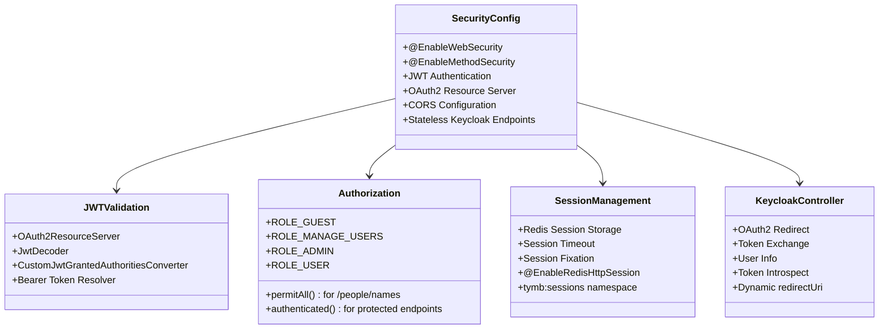
```mermaid
classDiagram
    class SecurityConfig {
        +@EnableWebSecurity
        +@EnableMethodSecurity
        +JWT Authentication
        +OAuth2 Resource Server
        +CORS Configuration
        +Stateless Keycloak Endpoints
    }
    
    class JWTValidation {
        +OAuth2ResourceServer
        +JwtDecoder
        +CustomJwtGrantedAuthoritiesConverter
        +Bearer Token Resolver
    }
    
    class Authorization {
        +ROLE_GUEST
        +ROLE_MANAGE_USERS
        +ROLE_ADMIN
        +ROLE_USER
        +permitAll() for /people/names
        +authenticated() for protected endpoints
    }
    
    class SessionManagement {
        +Redis Session Storage
        +Session Timeout
        +Session Fixation
        +@EnableRedisHttpSession
        +tymb:sessions namespace
    }
    
    class KeycloakController {
        +OAuth2 Redirect
        +Token Exchange
        +User Info
        +Token Introspect
        +Dynamic redirectUri
    }
    
    SecurityConfig --> JWTValidation
    SecurityConfig --> Authorization
    SecurityConfig --> SessionManagement
    SecurityConfig --> KeycloakController
```

#### 6.1. Google Authenticator (TOTP) 2FA Setup

**目的：** 强制所有用户（包括 admin 和 API 调用者）在登入时使用 Google Authenticator 进行二次验证。

**当前状态（已部署到 K8s）：**

Keycloak 26.1.4 已在 `peoplesystem.tatdvsonorth.com/sso` 启用 TOTP 2FA：
- **Realm**: `master`（admin 登入 dashboard） + `PeopleSystem`（API 客户端登入）
- **OTP 政策**: TOTP / SHA1 / 6 位验证码 / 30 秒循环
- **Required Action**: `CONFIGURE_TOTP` → `enabled=true`, `defaultAction=true`
- **浏览器流程**: `Browser - Conditional OTP`（OTP Form 已挂上）

**已强制 TOTP 的用户：**
- master realm: `admin`, `wavo`
- PeopleSystem realm: `chiaki`, `sorane`

**新增用户自动强制：** 由于设了 `defaultAction=true`，所有新建用户下次登入会被要求设定 Authenticator。

**登入流程：**

```
用户在浏览器或 REST API 登入
  ↓
输入用户名/密码 (1FA)
  ↓
Keycloak 检查 requiredActions
  ↓
若用户未设定 Authenticator → 显示 QR code，用 Google Authenticator 扫描
  ↓
若已设定 → 要求输入 6 位验证码
  ↓
验证码正确 → 登入成功，获得 JWT token
```

**用户端操作（首次注册 Authenticator）：**

1. **安装 Authenticator App**（选一个）：
   - Google Authenticator
   - Microsoft Authenticator
   - FreeOTP
   - 任何支持 TOTP 标准的 app

2. **登入时注册**：
   - 访问 `https://peoplesystem.tatdvsonorth.com/sso/realms/PeopleSystem/account/`
   - 或 admin dashboard `https://peoplesystem.tatdvsonorth.com/sso/admin/`
   - 输入用户名/密码
   - 系统显示 QR code
   - 用 Authenticator app 扫描 QR code
   - 输入 app 显示的 6 位码确认
   - 完成！下次登入就要验证码

**安全考量：**

- **恢复码**：首次设定时务必保存 recovery code（防止丢失手机时无法登入）
- **Admin 备援**：admin 帐号只有一个，建议另外申请一个备用 admin 帐号，或保存 kcadm recovery 步骤
- **Admin CLI 救援**（若锁死）：
  ```bash
  ssh oke-node
  kubectl exec keycloak-559994d657-m8t7q -- \
    /opt/keycloak/bin/kcadm.sh config credentials \
      --server http://localhost:8080/sso \
      --realm master \
      --user admin \
      --password admin
  # 可以重置用户的 OTP credential 或 requiredActions
  ```

**扩大范围（若需强制其他既有用户）：**

```bash
# 获取所有用户 ID
ssh oke-node
kubectl exec keycloak-559994d657-m8t7q -- \
  /opt/keycloak/bin/kcadm.sh get users -r PeopleSystem --fields id,username

# 对任一用户添加 CONFIGURE_TOTP
kubectl exec keycloak-559994d657-m8t7q -- \
  /opt/keycloak/bin/kcadm.sh update users/<USER_ID> -r PeopleSystem \
    -s 'requiredActions=["CONFIGURE_TOTP"]'
```

**Email/SMS OTP（未部署）：**

原生 Keycloak 不支持 Email/SMS OTP 作为 2FA。如需支持，需部署自定义 SPI 插件（工程量大）。详见项目记录。

---

#### 7. Error Handling Architecture
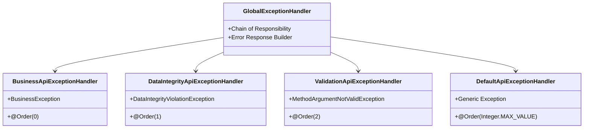
```mermaid
classDiagram
    class GlobalExceptionHandler {
        +Chain of Responsibility
        +Error Response Builder
    }
    
    class BusinessApiExceptionHandler {
        +@Order(0)
        +BusinessException
    }
    
    class DataIntegrityApiExceptionHandler {
        +@Order(1)
        +DataIntegrityViolationException
    }
    
    class ValidationApiExceptionHandler {
        +@Order(2)
        +MethodArgumentNotValidException
    }
    
    class DefaultApiExceptionHandler {
        +@Order(Integer.MAX_VALUE)
        +Generic Exception
    }
    
    GlobalExceptionHandler --> BusinessApiExceptionHandler
    GlobalExceptionHandler --> DataIntegrityApiExceptionHandler
    GlobalExceptionHandler --> ValidationApiExceptionHandler
    GlobalExceptionHandler --> DefaultApiExceptionHandler
```

#### 8. Monitoring Architecture
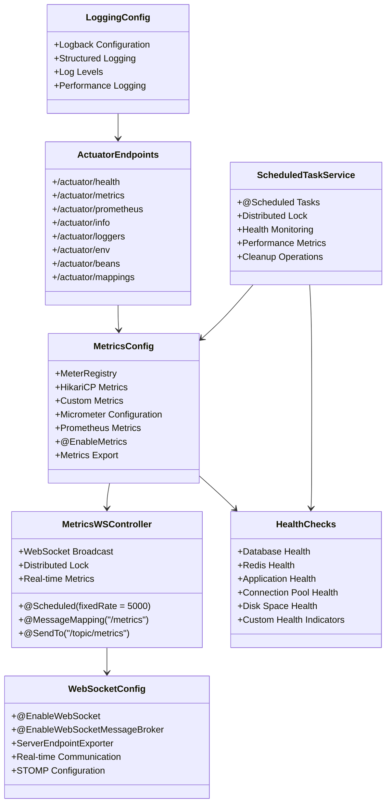
```mermaid
classDiagram
    class ActuatorEndpoints {
        +/actuator/health
        +/actuator/metrics
        +/actuator/prometheus
        +/actuator/info
        +/actuator/loggers
        +/actuator/env
        +/actuator/beans
        +/actuator/mappings
    }
    
    class MetricsConfig {
        +MeterRegistry
        +HikariCP Metrics
        +Custom Metrics
        +Micrometer Configuration
        +Prometheus Metrics
        +@EnableMetrics
        +Metrics Export
    }
    
    class MetricsWSController {
        +@Scheduled(fixedRate = 5000)
        +WebSocket Broadcast
        +Distributed Lock
        +Real-time Metrics
        +@MessageMapping("/metrics")
        +@SendTo("/topic/metrics")
    }
    
    class HealthChecks {
        +Database Health
        +Redis Health
        +Application Health
        +Connection Pool Health
        +Disk Space Health
        +Custom Health Indicators
    }
    
    class WebSocketConfig {
        +@EnableWebSocket
        +@EnableWebSocketMessageBroker
        +ServerEndpointExporter
        +Real-time Communication
        +STOMP Configuration
    }
    
    class ScheduledTaskService {
        +@Scheduled Tasks
        +Distributed Lock
        +Health Monitoring
        +Performance Metrics
        +Cleanup Operations
    }
    
    class LoggingConfig {
        +Logback Configuration
        +Structured Logging
        +Log Levels
        +Performance Logging
    }
    
    ActuatorEndpoints --> MetricsConfig
    MetricsConfig --> MetricsWSController
    MetricsConfig --> HealthChecks
    MetricsWSController --> WebSocketConfig
    ScheduledTaskService --> MetricsConfig
    ScheduledTaskService --> HealthChecks
    LoggingConfig --> ActuatorEndpoints
```

#### 9. RabbitMQ Data Flow Architecture

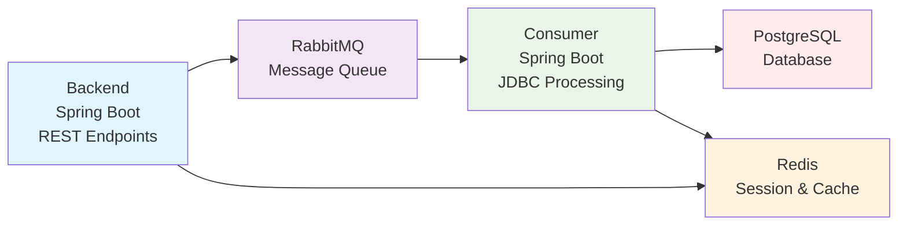
```mermaid
graph LR
    A[Backend<br/>Spring Boot<br/>REST Endpoints] --> B[RabbitMQ<br/>Message Queue]
    B --> C[Consumer<br/>Spring Boot<br/>JDBC Processing]
    C --> D[PostgreSQL<br/>Database]

    A --> E[Redis<br/>Session & Cache]
    C --> E

    classDef producer fill:#e1f5fe
    classDef mq fill:#f3e5f5
    classDef consumer fill:#e8f5e8
    classDef database fill:#ffebee
    classDef cache fill:#fff3e0

    class A producer
    class B mq
    class C consumer
    class D database
    class E cache
```

**架構說明：**
- **Backend (Producer)**: Spring Boot 應用程式，提供 REST API 端點，負責接收請求並發送訊息到 RabbitMQ
- **Consumer**: Spring Boot 應用程式，使用 JDBC 處理訊息並將數據寫入 PostgreSQL 資料庫
- **RabbitMQ**: 訊息佇列，實現非同步處理和解耦
- **PostgreSQL**: 主要資料庫，儲存處理後的數據
- **Redis**: 會話儲存、快取和分散式鎖，支援 `tymb:sessions` 和 `damage-calculations` 命名空間
- **Session 使用**: 目前僅 CKEditor 和 DeckOfCards 模組使用 Session 認證
- **其他模組**: 使用 JWT 無狀態認證

## Design Patterns

### 🎯 設計模式 (Design Patterns)

本專案主要採用以下設計模式來確保高內聚與低耦合分層架構：

- **依賴注入 (Dependency Injection)**: 透過 Spring IoC 容器管理組件生命週期與相依性。
- **策略模式 (Strategy Pattern)**: 實作於特定的業務邏輯 (如 `DamageStrategy`)，動態計算武器與角色傷害。
- **代理與切面模式 (Proxy / AOP)**: 實作分散式限流 (`RateLimiterAspect`) 與統一日誌處理，將橫切關注點自業務邏輯抽離。
- **責任鏈與過濾器模式 (Filter / Chain of Responsibility)**: 透過 Spring Security 驗證鏈與請求限流過濾器處理所有的進入請求。

## Other

### Documentation and Tools

- Local Environment: `http://localhost:8080/tymb/swagger-ui/index.html#/`
- Production Environment: `https://peoplesystem.tatdvsonorth.com/tymb/swagger-ui/index.html#/`

#### JavaDoc Documentation
- Local Environment: `http://localhost:8080/tymb/javadoc/index.html`
- Production Environment: `https://peoplesystem.tatdvsonorth.com/tymb/javadoc/index.html`

#### Docker Build
- Build Command: `docker build -t papakao/ty-multiverse-backend:latest .`
- Multi-platform Build: `docker buildx build --platform linux/arm64 -t papakao/ty-multiverse-backend:latest --push .`

