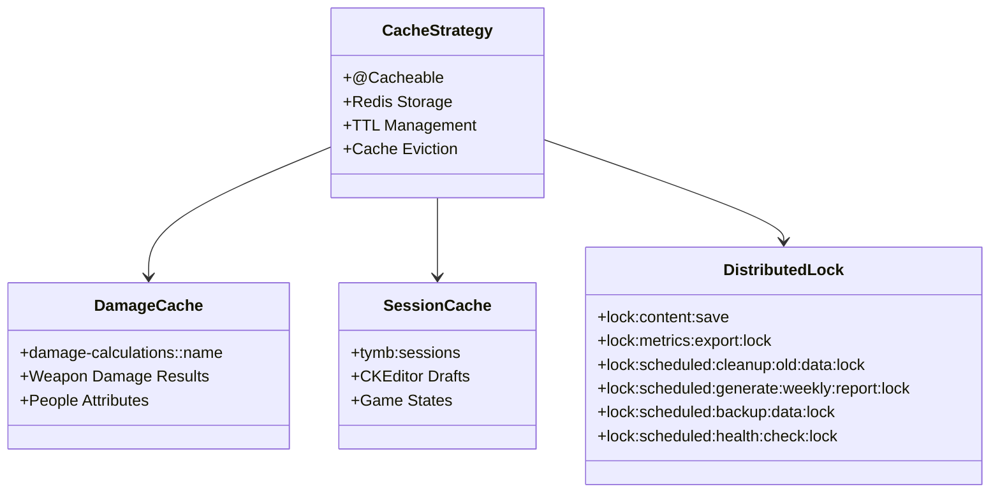
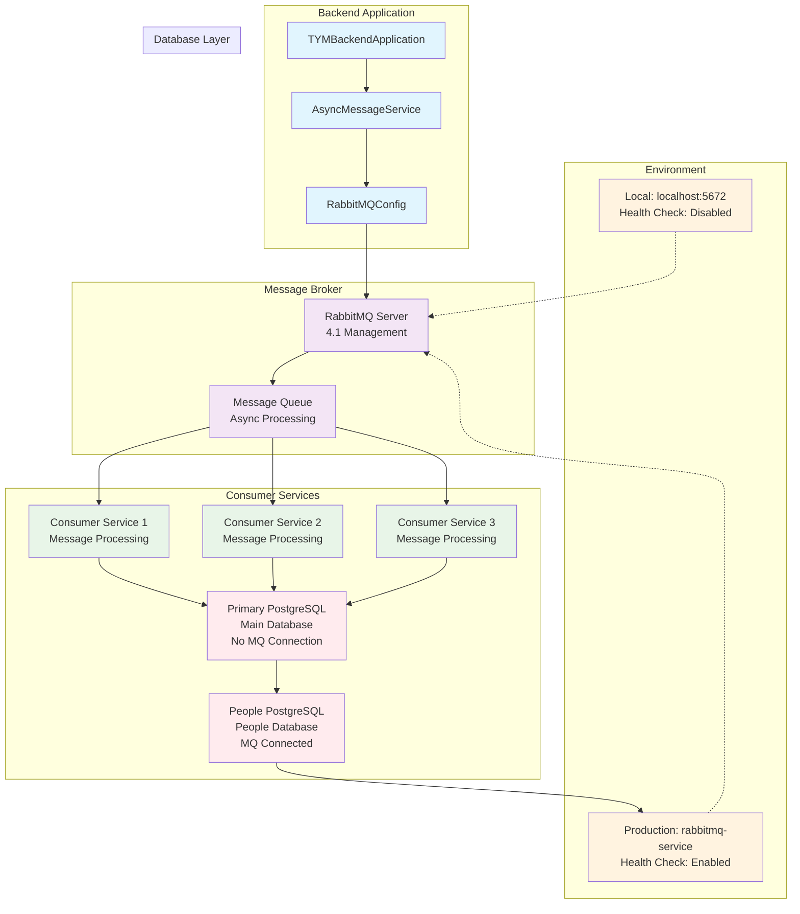

# TY-Multiverse-Backend
Personal Website Backend System

## Architecture Design

### 1. Core Architecture

### 2. Module Architecture

### 3. Database Optimization Architecture

### 4. Cache Architecture

### 4.2. Lua Script Flow

### 4.2.1. Distributed Lock Usage Scenario

### 5. Connection Pool Architecture

### 6. Security Authentication Architecture

### 7. Error Handling Architecture

### 8. Monitoring Architecture

### 9. RabbitMQ Data Flow Architecture

## Documentation and Tools

### Swagger UI
- Local Environment: `http://localhost:8080/tymb/swagger-ui/index.html#/`
- Production Environment: `https://peoplesystem.tatdvsonorth.com/tymb/swagger-ui/index.html#/`

### JavaDoc Documentation
- Local Environment: `http://localhost:8080/tymb/javadoc/index.html`
- Production Environment: `https://peoplesystem.tatdvsonorth.com/tymb/javadoc/index.html`

### Docker Build
- Build Command: `docker build -t papakao/ty-multiverse-backend:latest .`
- Multi-platform Build: `docker buildx build --platform linux/arm64 -t papakao/ty-multiverse-backend:latest --push .`
