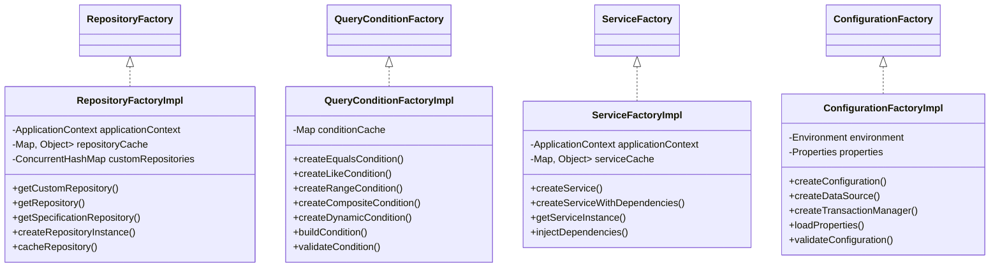

# TY-Multiverse-Backend
這是我的個人網站的 Backend。

## 架構設計

### 1. 核心架構


### 2. 領域驅動設計 (DDD) 架構

#### 2.1 DDD 分層架構


- **表現層 (Presentation Layer)**
  - 控制器 (`Controller`) 處理 HTTP 請求
  - 資料傳輸物件 (`DTO`) 用於 API 請求/響應
  - 負責與外部系統的通信

- **應用層 (Application Layer)**
  - 服務類 (`Service`) 協調領域物件
  - 處理事務和協調多個領域物件
  - 不包含業務規則，只負責流程協調

- **領域層 (Domain Layer)**
  - 實體 (`Entity`) 和值物件 (`ValueObject`) 包含業務邏輯
  - 領域服務 (`DomainService`) 處理跨實體的業務邏輯
  - 儲存庫介面 (`Repository`) 定義資料存取契約
  - 聚合根 (`Aggregate`) 確保資料一致性

- **基礎設施層 (Infrastructure Layer)**
  - 儲存庫實現 (`RepositoryImpl`) 提供資料持久化
  - 資料存取器 (`DataAccessor`) 抽象化資料存取
  - 外部服務整合

#### 2.2 領域模型示例


#### 2.3 領域驅動設計原則

1. **統一語言 (Ubiquitous Language)**
   - 在代碼和文檔中使用一致的術語
   - 領域專家、開發人員和業務人員共享相同的語言

2. **限界上下文 (Bounded Context)**
   - 每個模組 (people, weapon, livestock, gallery, deckofcards, ckeditor) 代表一個限界上下文
   - 上下文之間通過明確的介面進行通信

3. **實體與值物件 (Entity vs Value Object)**
   - 實體：具有唯一標識的物件 (如 People, Weapon)
   - 值物件：描述事物特徵的物件，無唯一標識

4. **聚合 (Aggregate)**
   - 聚合根：People, Weapon 等
   - 聚合邊界：確保資料一致性

5. **領域服務 (Domain Service)**
   - 處理跨實體的業務邏輯
   - 不屬於任何單一實體的業務規則

6. **儲存庫 (Repository)**
   - 提供資料持久化抽象
   - 隱藏資料存取細節

7. **工廠 (Factory)**
   - 複雜物件的創建邏輯
   - 確保物件創建的完整性

### 3. 設計模式與工廠架構

#### 3.1 Singleton 模式


- **目的**: 確保系統資源的唯一性和一致性
- **應用**: 配置類、服務類、控制器等核心組件
- **優點**: 資源共享、狀態一致性、內存優化

#### 3.2 Factory 模式


- **目的**: 提供統一的對象創建接口
- **應用**: Repository工廠、查詢條件工廠
- **優點**: 解耦對象創建、統一管理實例、支持擴展

#### 3.3 工廠方法實現


#### 3.4 工作原理


- **註冊流程**: Spring容器掃描並註冊工廠Bean
- **實例化**: 按需創建並緩存實例
- **依賴注入**: 通過構造器注入工廠實例
- **使用方式**: 服務層通過工廠獲取所需實例

### 4. IoC/AOP 架構

#### 4.1 IoC 容器


#### 4.2 AOP 切面


### 5. 架構優勢

1. **解耦與內聚**
   - IoC 實現依賴反轉
   - AOP 處理橫切關注點
   - 工廠模式管理對象創建

2. **可維護性**
   - 清晰的職責分離
   - 統一的異常處理
   - 集中的配置管理

3. **可擴展性**
   - 模塊化設計
   - 接口導向
   - 鬆散耦合

4. **性能優化**
   - 單例資源共享
   - 工廠對象緩存
   - AOP 性能監控

## 錯誤處理架構

### 1. 錯誤處理架構圖


### 2. 模組特定異常


### 3. 錯誤處理流程


### 4. 錯誤處理優點

1. **統一錯誤格式**
   - 所有錯誤響應格式一致
   - 前端可以統一處理

2. **標準化錯誤碼**
   - 使用標準 HTTP 狀態碼

3. **詳細錯誤信息**
   - 包含錯誤代碼、消息和詳情
   - 記錄錯誤發生時間和路徑

4. **模組化設計**
   - 每個模組有自己的異常類

## 監控與健康檢查

### 1. Actuator 端點

應用程式提供了以下 Actuator 端點用於監控：

#### 1.1 健康檢查
```
GET https://***/tymb/actuator/health
```
提供應用程式的健康狀態，包括：
- 應用程式狀態
- 資料庫連接狀態
- 磁碟空間
- 其他組件狀態

#### 1.2 指標信息
```
GET https://***/tymb/actuator/metrics
```
提供所有可用的指標列表，包括：
- JVM 指標
- 系統指標
- 應用程式指標
- 自定義指標

#### 1.3 HikariCP 連接池指標
```
GET https://***/tymb/actuator/metrics/hikaricp.connections
GET https://***/tymb/actuator/metrics/hikaricp.connections.active
GET https://***/tymb/actuator/metrics/hikaricp.connections.idle
GET https://***/tymb/actuator/metrics/hikaricp.connections.pending
```
提供連接池的詳細狀態：
- 活動連接數
- 空閒連接數
- 等待連接數
- 連接獲取時間
- 連接使用時間
- 連接泄漏檢測

#### 1.4 Prometheus 格式指標
```
GET https://***/tymb/actuator/prometheus
```
提供 Prometheus 格式的指標數據，可用於：
- 指標收集
- 監控面板
- 警報設置

### 2. 監控架構


### 4. 使用建議

1. **健康檢查**
   - 定期檢查應用程式健康狀態
   - 設置自動化監控
   - 配置警報閾值

2. **性能監控**
   - 監控關鍵指標
   - 分析性能瓶頸
   - 優化資源使用

3. **問題診斷**
   - 使用指標追蹤問題
   - 分析錯誤模式
   - 預防系統故障

## swagger ui

```bash
http://localhost:8080/tymb/swagger-ui/index.html#/
https://peoplesystem.tatdvsonorth.com/tymb/swagger-ui/index.html#/
```

## image 建置

```bash
# Build image
mvn clean package -DskipTests
docker buildx build --platform linux/arm64 -t papakao/ty-multiverse-backend:latest --push .
mvn -P platform install
docker build -t papakao/ty-multiverse-backend:latest .
docker push papakao/ty-multiverse-backend:latest

mvn -P platform install
docker buildx build --platform linux/arm64 -t papakao/ty-multiverse-backend:latest --push .
docker push papakao/ty-multiverse-backend:latest

mvn -P platform install
docker build -t ty-multiverse-backend .
docker run -d --name ty-multiverse-backend `
  -e "SPRING_PROFILES_ACTIVE=platform" `
  -e "URL_BACKEND=http://localhost:8080/tymb" `
  -e "SPRING_DATASOURCE_URL=jdbc:postgresql://*****:****/peoplesystem" `
  -e "SPRING_DATASOURCE_USERNAME=w*****o" `
  -e "SPRING_DATASOURCE_PASSWORD=W*****=" `
  -p 8080:8080 `
  ty-multiverse-backend

# Docker Agent
docker build -t papakao/maven-docker-agent:latest -f Dockerfile.agent .
docker push papakao/maven-docker-agent:latest
```

### 3. 並發控制

#### 3.1 樂觀鎖定


#### 3.2 樂觀鎖定機制
- **實現方式**: 使用 `@Version` 註解
- **觸發時機**: 並發更新衝突
- **處理策略**: 
  - 自動重試
  - 返回衝突狀態
  - 提示用戶刷新

## 單元測試架構

### 1. 測試架構概述


### 2. 測試分層設計

#### 2.1 配置層 (Configuration)
- **TestConfig.java**
  - 提供測試環境的基礎配置
  - 使用 H2 內存數據庫
  - 通過 `@TestConfiguration` 和 `@Primary` 確保測試環境隔離
  - 配置測試專用的數據源和事務管理器

#### 2.2 數據訪問層測試 (Repository Tests)
- **PeopleRepositoryTest.java**
  - 使用 `@DataJpaTest` 進行 JPA 相關測試
  - 測試基本的 CRUD 操作
  - 驗證數據庫操作的正確性
  - 使用 H2 內存數據庫進行測試

#### 2.3 服務層測試 (Service Tests)
- **PeopleServiceTest.java**
  - 使用 Mockito 進行依賴模擬
  - 測試業務邏輯的完整性
  - 驗證服務層方法的行為
  - 處理異常情況的測試

#### 2.4 控制器層測試 (Controller Tests)
- **PeopleControllerTest.java**
  - 測試 API 接口的正確性
  - 驗證 HTTP 響應和狀態碼
  - 測試請求參數的處理
  - 驗證服務層的調用

## CI/CD Pipeline

### 1. Pipeline Overview


### 2. Pipeline Components

#### 2.1 Agent Configuration
- **Maven Container**: `maven:3.8.4-openjdk-17`
- **Docker Container**: `docker:23-dind`
- **Kubectl Container**: `bitnami/kubectl:1.30.7`