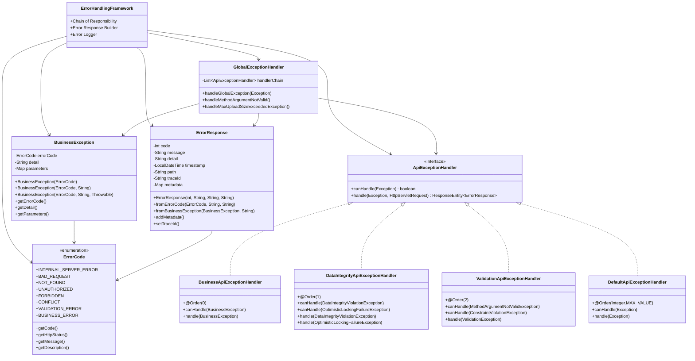
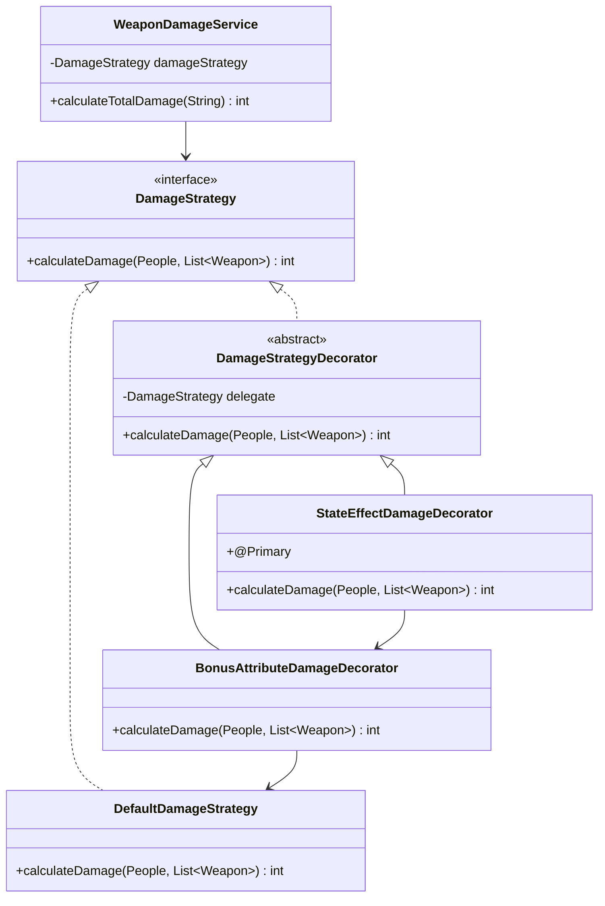
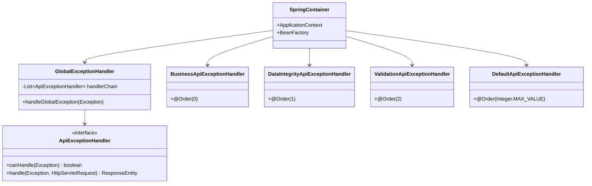
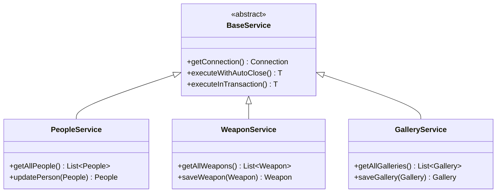
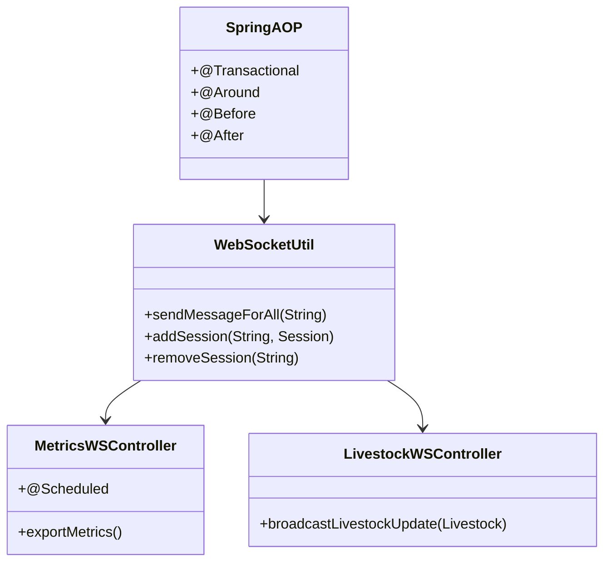
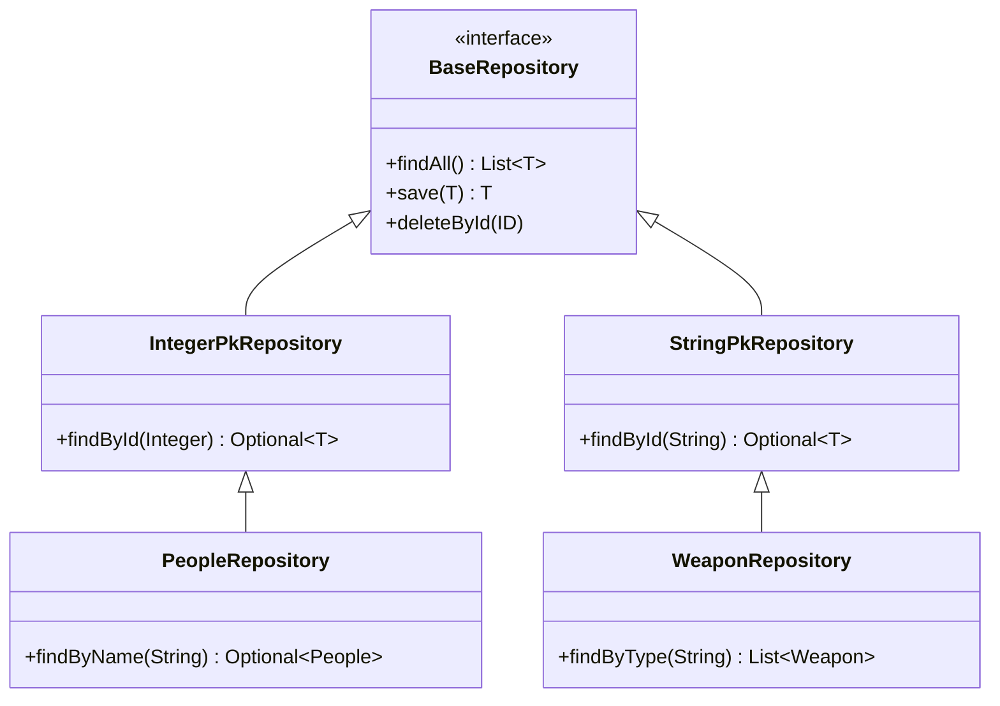
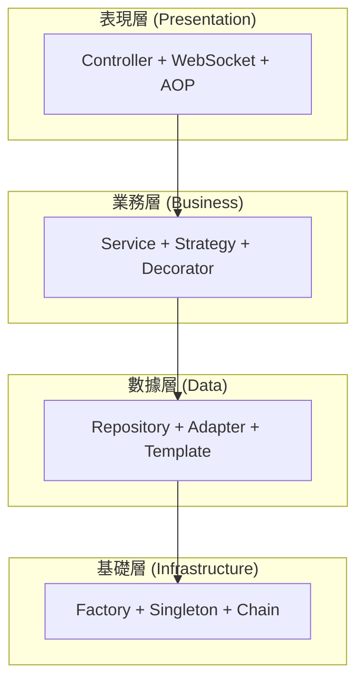
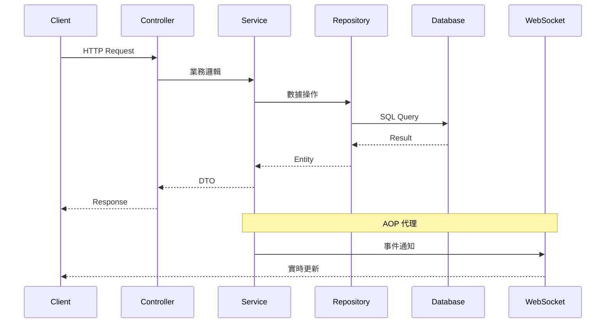

# TY-Multiverse-Backend
個人網站後端系統

## 架構設計

### 1. Redis Session 架構

### 2. Spring Boot 核心架構

### 3. 領域驅動設計 (DDD) 架構

### 4. 模組架構圖

### 5. 傷害計算策略模式架構

### 6. Spring IoC 工廠模式架構

### 7. IoC/AOP 架構

## 安全認證架構

### 1. Keycloak JWT 認證架構

## 錯誤處理架構 (Chain of Responsibility Pattern)

#### 2. 處理流程

## 監控與健康檢查

## 單元測試架構

## CI/CD Pipeline

## 設計模式相互關係詳解

### 1. 策略模式 + 裝飾器模式的協作

### 2. 責任鏈模式 + 工廠模式的整合

### 3. 模板方法模式 + 單例模式的結合

### 4. 代理模式 + 觀察者模式的協作

### 5. 適配器模式 + Repository 模式的整合

### 6. 設計模式的層級關係

### 7. 模式協作流程

## 文檔與工具

### Swagger UI
- 本地環境：`http://localhost:8080/tymb/swagger-ui/index.html#/`
- 生產環境：`https://peoplesystem.tatdvsonorth.com/tymb/swagger-ui/index.html#/`

### JavaDoc 文檔
- 本地環境：`http://localhost:8080/tymb/javadoc/index.html`
- 生產環境：`https://peoplesystem.tatdvsonorth.com/tymb/javadoc/index.html`

### Docker 建置
- 建置指令：`docker build -t papakao/ty-multiverse-backend:latest .`
- 多平台建置：`docker buildx build --platform linux/arm64 -t papakao/ty-multiverse-backend:latest --push .`