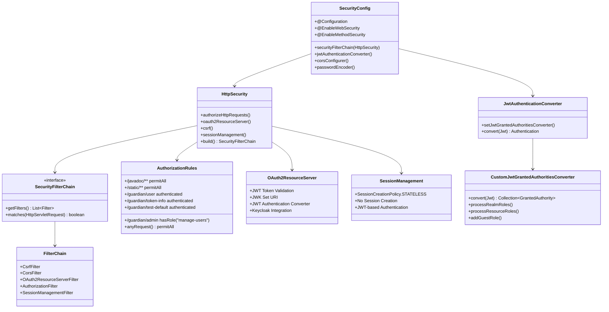

# TY-Multiverse-Backend
個人網站後端系統

## 架構設計

### 1. Redis Session 架構


### 2. Spring Boot 核心架構


### 3. 領域驅動設計 (DDD) 架構


### 4. 模組架構圖


### 5. 傷害計算策略模式架構


### 6. Spring IoC 工廠模式架構


### 7. IoC/AOP 架構


## 安全認證架構

### 1. Spring Security Filter Chain 架構


### 2. Spring Security Filter Chain 處理流程


### 3. JWT 權限轉換流程


### 4. Spring Security 組件關係圖


### 5. Spring Security Filter Chain 完整架構


### 6. Spring Security 主流 Filter 流程


### 7. Spring Security Filter 處理順序


### 8. Spring Security 常量枚舉架構


### 9. SecurityConstants 枚舉分類


### 10. OAuth2 Resource Server Token 提取流程


### 11. OAuth2 架構角色關係


### 12. 混合認證架構 (Session + JWT)


### 13. Session 服務架構


### 14. Keycloak JWT 認證架構
```mermaid
sequenceDiagram
    participant Client
    participant Keycloak
    participant Backend
    participant Database
    
    Client->>Keycloak: 登入請求
    Keycloak->>Database: 驗證用戶
    Keycloak-->>Client: 返回 JWT Token
    Client->>Backend: API 請求 + JWT Token
    Backend->>Keycloak: 驗證 JWT Token
    Keycloak-->>Backend: 驗證結果
    Backend-->>Client: API 響應
```

### 15. Redis 數據結構與存儲流程
```mermaid
graph TB
    subgraph "Redis 存儲架構"
        A[Session 數據] --> B[tymb:sessions:sessions:*]
        C[Session 過期] --> D[tymb:sessions:expires:*]
        E[分布式鎖] --> F[lock:*]
        G[過期時間] --> H[TTL 機制]
    end
    
    subgraph "數據類型"
        I[Session 屬性] --> J[JSON 格式]
        K[鎖值] --> L[UUID 字符串]
        M[過期時間] --> N[TTL 秒數]
    end
    
    subgraph "應用組件"
        O[CKEditor] --> P[Session 存儲]
        Q[DeckOfCards] --> R[Session 存儲]
        S[DistributedLockUtil] --> T[鎖存儲]
    end
    
    P --> A
    R --> A
    T --> E
```

### 16. Redis Session 數據存儲結構
```mermaid
flowchart TD
    A[應用層存儲] --> B[Spring Session 處理]
    B --> C[Redis 序列化]
    C --> D[Redis 存儲]
    
    subgraph "Session 數據示例"
        E[tymb:sessions:sessions:abc123] --> F[{
          "creationTime": 1640995200000,
          "lastAccessedTime": 1640995260000,
          "maxInactiveInterval": 3600,
          "attributes": {
            "user_authenticated": true,
            "last_activity": 1640995260000,
            "editor_draft_editor1": "草稿內容...",
            "blackjack_game_state": {
              "game_started": 1640995200000,
              "player_hand": ["A♠", "K♥"],
              "dealer_hand": ["Q♣"],
              "game_status": "active"
            }
          }
        }]
    end
    
    subgraph "分布式鎖示例"
        G[lock:metrics:export:lock] --> H["550e8400-e29b-41d4-a716-446655440000"]
        I[lock:content:save:lock] --> J["6ba7b810-9dad-11d1-80b4-00c04fd430c8"]
    end
    
    D --> E
    D --> G
```

### 17. Redis 存儲流程詳解
```mermaid
sequenceDiagram
    participant App as 應用層
    participant Session as Spring Session
    participant Serializer as 序列化器
    participant Redis as Redis 存儲
    
    App->>Session: session.setAttribute("key", value)
    Session->>Serializer: 序列化 Session 對象
    Serializer->>Redis: 存儲序列化數據
    Redis-->>Serializer: 確認存儲
    Serializer-->>Session: 序列化完成
    Session-->>App: 存儲成功
    
    Note over App,Redis: 讀取流程
    App->>Session: session.getAttribute("key")
    Session->>Redis: 讀取序列化數據
    Redis-->>Session: 返回數據
    Session->>Serializer: 反序列化
    Serializer-->>Session: 反序列化完成
    Session-->>App: 返回原始數據
```

### 18. Redis 數據類型與序列化
```mermaid
graph LR
    subgraph "應用數據類型"
        A[Boolean] --> D[user_authenticated: true]
        B[Long] --> E[last_activity: 1640995260000]
        C[String] --> F[editor_draft: "草稿內容..."]
        G[Map] --> H[game_state: {...}]
    end
    
    subgraph "序列化過程"
        I[GenericJackson2JsonRedisSerializer] --> J[JSON 格式]
        K[StringRedisSerializer] --> L[純字符串]
    end
    
    subgraph "Redis 存儲"
        M[Session 數據] --> N[JSON 序列化]
        O[鎖數據] --> P[字符串序列化]
    end
    
    D --> I
    E --> I
    F --> I
    H --> I
    N --> M
    P --> O
```

### 19. 統一錯誤代碼 Enum 架構
```mermaid
classDiagram
    class ErrorCode {
        +通用業務錯誤 (SYS_*)
        +檔案相關錯誤 (FILE_*)
        +認證相關錯誤 (AUTH_*)
        +授權相關錯誤 (AUTHZ_*)
        +登出相關錯誤 (LOGOUT_*)
        +會話相關錯誤 (SESSION_*)
        +應用層認證錯誤 (APP_*)
        +安全配置相關 (CONFIG_*)
    }
    
    class ErrorResponse {
        +錯誤代碼
        +錯誤訊息
        +詳細信息
        +時間戳
    }
    
    ErrorCode --> ErrorResponse
```

### 20. 統一錯誤代碼處理流程
```mermaid
sequenceDiagram
    participant Client
    participant SecurityFilter
    participant AuthenticationEntryPoint
    participant AccessDeniedHandler
    participant ErrorCode
    participant ErrorResponse
    
    Client->>SecurityFilter: 認證/授權請求
    alt 認證失敗
        SecurityFilter->>AuthenticationEntryPoint: 觸發認證失敗
        AuthenticationEntryPoint->>ErrorCode: 獲取錯誤訊息
        ErrorCode-->>AuthenticationEntryPoint: AUTHENTICATION_FAILED
        AuthenticationEntryPoint->>ErrorResponse: 創建錯誤響應
        ErrorResponse-->>AuthenticationEntryPoint: 錯誤響應對象
        AuthenticationEntryPoint-->>Client: 401 Unauthorized
    else 授權失敗
        SecurityFilter->>AccessDeniedHandler: 觸發授權失敗
        AccessDeniedHandler->>ErrorCode: 獲取錯誤訊息
        ErrorCode-->>AccessDeniedHandler: AUTHORIZATION_FAILED
        AccessDeniedHandler->>ErrorResponse: 創建錯誤響應
        ErrorResponse-->>AccessDeniedHandler: 錯誤響應對象
        AccessDeniedHandler-->>Client: 403 Forbidden
    end
```

## 錯誤處理架構 (Chain of Responsibility Pattern)

## 錯誤處理架構 (Chain of Responsibility Pattern)
```mermaid
classDiagram
    class ErrorHandlingFramework {
        +Chain of Responsibility
        +Error Response Builder
        +Error Logger
    }
    
    class ErrorCode {
        <<enumeration>>
        +INTERNAL_SERVER_ERROR
        +BAD_REQUEST
        +NOT_FOUND
        +UNAUTHORIZED
        +FORBIDDEN
        +CONFLICT
        +VALIDATION_ERROR
        +BUSINESS_ERROR
        +getCode()
        +getHttpStatus()
        +getMessage()
        +getDescription()
    }
    
    class BusinessException {
        -ErrorCode errorCode
        -String detail
        -Map<String, Object> parameters
        +BusinessException(ErrorCode)
        +BusinessException(ErrorCode, String)
        +BusinessException(ErrorCode, String, Throwable)
        +getErrorCode()
        +getDetail()
        +getParameters()
    }
    
    class ErrorResponse {
        -int code
        -String message
        -String detail
        -LocalDateTime timestamp
        -String path
        -String traceId
        -Map<String, Object> metadata
        +ErrorResponse(int, String, String, String)
        +fromErrorCode(ErrorCode, String, String)
        +fromBusinessException(BusinessException, String)
        +addMetadata()
        +setTraceId()
    }
    
    class GlobalExceptionHandler {
        -List~ApiExceptionHandler~ handlerChain
        +handleGlobalException(Exception)
        +handleMethodArgumentNotValid()
        +handleMaxUploadSizeExceededException()
    }
    
    class ApiExceptionHandler {
        <<interface>>
        +canHandle(Exception) boolean
        +handle(Exception, HttpServletRequest) ResponseEntity~ErrorResponse~
    }
    
    class BusinessApiExceptionHandler {
        +@Order(0)
        +canHandle(BusinessException)
        +handle(BusinessException)
    }
    
    class DataIntegrityApiExceptionHandler {
        +@Order(1)
        +canHandle(DataIntegrityViolationException)
        +canHandle(OptimisticLockingFailureException)
        +handle(DataIntegrityViolationException)
        +handle(OptimisticLockingFailureException)
    }
    
    class ValidationApiExceptionHandler {
        +@Order(2)
        +canHandle(MethodArgumentNotValidException)
        +canHandle(ConstraintViolationException)
        +handle(ValidationException)
    }
    
    class DefaultApiExceptionHandler {
        +@Order(Integer.MAX_VALUE)
        +canHandle(Exception)
        +handle(Exception)
    }
    
    ErrorHandlingFramework --> ErrorCode
    ErrorHandlingFramework --> BusinessException
    ErrorHandlingFramework --> ErrorResponse
    ErrorHandlingFramework --> GlobalExceptionHandler
    ErrorHandlingFramework --> ApiExceptionHandler
    GlobalExceptionHandler --> ApiExceptionHandler
    ApiExceptionHandler <|.. BusinessApiExceptionHandler
    ApiExceptionHandler <|.. DataIntegrityApiExceptionHandler
    ApiExceptionHandler <|.. ValidationApiExceptionHandler
    ApiExceptionHandler <|.. DefaultApiExceptionHandler
    BusinessException --> ErrorCode
    ErrorResponse --> ErrorCode
    GlobalExceptionHandler --> BusinessException
    GlobalExceptionHandler --> ErrorResponse
```

#### 2. 處理流程

```mermaid
sequenceDiagram
    participant Client
    participant GlobalExceptionHandler
    participant BusinessHandler
    participant DataIntegrityHandler
    participant ValidationHandler
    participant DefaultHandler
    
    Client->>GlobalExceptionHandler: 拋出異常
    GlobalExceptionHandler->>BusinessHandler: canHandle()?
    alt 業務異常
        BusinessHandler-->>GlobalExceptionHandler: true
        BusinessHandler->>GlobalExceptionHandler: handle()
        GlobalExceptionHandler-->>Client: ErrorResponse
    else 資料完整性異常
        BusinessHandler-->>GlobalExceptionHandler: false
        GlobalExceptionHandler->>DataIntegrityHandler: canHandle()?
        DataIntegrityHandler-->>GlobalExceptionHandler: true
        DataIntegrityHandler->>GlobalExceptionHandler: handle()
        GlobalExceptionHandler-->>Client: ErrorResponse
    else 驗證異常
        DataIntegrityHandler-->>GlobalExceptionHandler: false
        GlobalExceptionHandler->>ValidationHandler: canHandle()?
        ValidationHandler-->>GlobalExceptionHandler: true
        ValidationHandler->>GlobalExceptionHandler: handle()
        GlobalExceptionHandler-->>Client: ErrorResponse
    else 其他異常
        ValidationHandler-->>GlobalExceptionHandler: false
        GlobalExceptionHandler->>DefaultHandler: canHandle()?
        DefaultHandler-->>GlobalExceptionHandler: true
        DefaultHandler->>GlobalExceptionHandler: handle()
        GlobalExceptionHandler-->>Client: ErrorResponse
    end
```

## 監控與健康檢查
```mermaid
classDiagram
    class ActuatorEndpoints {
        +/health
        +/metrics
        +/prometheus
        +/info
        +/loggers
        +/env
    }
    
    class MetricsConfig {
        +configureMetrics()
        +MeterRegistry
        +DataSource
    }
    
    class MetricsWSController {
        +@Scheduled
        +exportMetrics()
        +WebSocket broadcast
        +DistributedLockUtil
    }
    
    class HikariCPMetrics {
        +connections
        +active
        +idle
        +pending
    }
    
    ActuatorEndpoints --> MetricsConfig
    MetricsConfig --> HikariCPMetrics
    MetricsWSController --> ActuatorEndpoints
```

## 單元測試架構
```mermaid
classDiagram
    class TestConfig {
        +@TestConfiguration
        +dataSource() DataSource
    }
    
    class RepositoryTests {
        +@DataJpaTest
        +RepositoryTest
    }
    
    class ServiceTests {
        +@ExtendWith(MockitoExtension)
        +ServiceTest
        +PeopleServiceTest
        +WeaponServiceTest
        +GalleryServiceTest
        +LivestockServiceTest
    }
    
    class ControllerTests {
        +@ExtendWith(MockitoExtension)
        +ControllerTest
    }
    
    TestConfig --> RepositoryTests : provides
    RepositoryTests --> ServiceTests : uses
    ServiceTests --> ControllerTests : uses
```

## CI/CD Pipeline
```mermaid
graph LR
    A[Jenkins Pipeline] --> B[Clone Repository]
    B --> C[Build with Maven]
    C --> D[Run Tests]
    D --> E[Build Docker Image with BuildKit]
    E --> F[Debug Environment]
    F --> G[Deploy to Kubernetes]
    
    subgraph "Jenkins Stages"
        B
        C
        D
        E
        F
        G
    end
    
    subgraph "Docker Build"
        E1[Multi-stage build]
        E2[Optimize layers]
        E3[Security scan]
    end
    
    subgraph "Kubernetes Deploy"
        G1[Apply deployment.yaml]
        G2[Health checks]
        G3[Rollback if needed]
    end
```

## 設計模式相互關係詳解

### 1. 策略模式 + 裝飾器模式的協作
```mermaid
classDiagram
    class DamageStrategy {
        <<interface>>
        +calculateDamage(People, List~Weapon~) int
    }
    
    class DefaultDamageStrategy {
        +calculateDamage(People, List~Weapon~) int
    }
    
    class DamageStrategyDecorator {
        <<abstract>>
        -DamageStrategy delegate
        +calculateDamage(People, List~Weapon~) int
    }
    
    class BonusAttributeDamageDecorator {
        +calculateDamage(People, List~Weapon~) int
    }
    
    class StateEffectDamageDecorator {
        +@Primary
        +calculateDamage(People, List~Weapon~) int
    }
    
    class WeaponDamageService {
        -DamageStrategy damageStrategy
        +calculateTotalDamage(String) int
    }
    
    DamageStrategy <|.. DefaultDamageStrategy
    DamageStrategy <|.. DamageStrategyDecorator
    DamageStrategyDecorator <|-- BonusAttributeDamageDecorator
    DamageStrategyDecorator <|-- StateEffectDamageDecorator
    BonusAttributeDamageDecorator --> DefaultDamageStrategy
    StateEffectDamageDecorator --> BonusAttributeDamageDecorator
    WeaponDamageService --> DamageStrategy
```

### 2. 責任鏈模式 + 工廠模式的整合
```mermaid
classDiagram
    class SpringContainer {
        +ApplicationContext
        +BeanFactory
    }
    
    class GlobalExceptionHandler {
        -List~ApiExceptionHandler~ handlerChain
        +handleGlobalException(Exception)
    }
    
    class ApiExceptionHandler {
        <<interface>>
        +canHandle(Exception) boolean
        +handle(Exception, HttpServletRequest) ResponseEntity
    }
    
    class BusinessApiExceptionHandler {
        +@Order(0)
    }
    
    class DataIntegrityApiExceptionHandler {
        +@Order(1)
    }
    
    class ValidationApiExceptionHandler {
        +@Order(2)
    }
    
    class DefaultApiExceptionHandler {
        +@Order(Integer.MAX_VALUE)
    }
    
    SpringContainer --> GlobalExceptionHandler
    SpringContainer --> BusinessApiExceptionHandler
    SpringContainer --> DataIntegrityApiExceptionHandler
    SpringContainer --> ValidationApiExceptionHandler
    SpringContainer --> DefaultApiExceptionHandler
    GlobalExceptionHandler --> ApiExceptionHandler
```

### 3. 模板方法模式 + 單例模式的結合
```mermaid
classDiagram
    class BaseService {
        <<abstract>>
        +getConnection() Connection
        +executeWithAutoClose() T
        +executeInTransaction() T
    }
    
    class PeopleService {
        +getAllPeople() List~People~
        +updatePerson(People) People
    }
    
    class WeaponService {
        +getAllWeapons() List~Weapon~
        +saveWeapon(Weapon) Weapon
    }
    
    class GalleryService {
        +getAllGalleries() List~Gallery~
        +saveGallery(Gallery) Gallery
    }
    
    BaseService <|-- PeopleService
    BaseService <|-- WeaponService
    BaseService <|-- GalleryService
```

### 4. 代理模式 + 觀察者模式的協作
```mermaid
classDiagram
    class SpringAOP {
        +@Transactional
        +@Around
        +@Before
        +@After
    }
    
    class WebSocketUtil {
        +sendMessageForAll(String)
        +addSession(String, Session)
        +removeSession(String)
    }
    
    class MetricsWSController {
        +@Scheduled
        +exportMetrics()
    }
    
    class LivestockWSController {
        +broadcastLivestockUpdate(Livestock)
    }
    
    SpringAOP --> WebSocketUtil
    WebSocketUtil --> MetricsWSController
    WebSocketUtil --> LivestockWSController
```

### 5. 適配器模式 + Repository 模式的整合
```mermaid
classDiagram
    class BaseRepository {
        <<interface>>
        +findAll() List~T~
        +save(T) T
        +deleteById(ID)
    }
    
    class IntegerPkRepository {
        +findById(Integer) Optional~T~
    }
    
    class StringPkRepository {
        +findById(String) Optional~T~
    }
    
    class PeopleRepository {
        +findByName(String) Optional~People~
    }
    
    class WeaponRepository {
        +findByType(String) List~Weapon~
    }
    
    BaseRepository <|-- IntegerPkRepository
    BaseRepository <|-- StringPkRepository
    IntegerPkRepository <|-- PeopleRepository
    StringPkRepository <|-- WeaponRepository
```

### 6. 設計模式的層級關係
```mermaid
graph TB
    subgraph "表現層 (Presentation)"
        A[Controller + WebSocket + AOP]
    end
    
    subgraph "業務層 (Business)"
        B[Service + Strategy + Decorator]
    end
    
    subgraph "數據層 (Data)"
        C[Repository + Adapter + Template]
    end
    
    subgraph "基礎層 (Infrastructure)"
        D[Factory + Singleton + Chain]
    end
    
    A --> B
    B --> C
    C --> D
```

### 7. 模式協作流程
```mermaid
sequenceDiagram
    participant Client
    participant Controller
    participant Service
    participant Repository
    participant Database
    participant WebSocket
    
    Client->>Controller: HTTP Request
    Controller->>Service: 業務邏輯
    Service->>Repository: 數據操作
    Repository->>Database: SQL Query
    Database-->>Repository: Result
    Repository-->>Service: Entity
    Service-->>Controller: DTO
    Controller-->>Client: Response
    
    Note over Service,WebSocket: AOP 代理
    Service->>WebSocket: 事件通知
    WebSocket-->>Client: 實時更新
```


## 文檔與工具

### Swagger UI
- 本地環境：`http://localhost:8080/tymb/swagger-ui/index.html#/`
- 生產環境：`https://peoplesystem.tatdvsonorth.com/tymb/swagger-ui/index.html#/`

### JavaDoc 文檔
- 本地環境：`http://localhost:8080/tymb/javadoc/index.html`
- 生產環境：`https://peoplesystem.tatdvsonorth.com/tymb/javadoc/index.html`

### Docker 建置
- 建置指令：`docker build -t papakao/ty-multiverse-backend:latest .`
- 多平台建置：`docker buildx build --platform linux/arm64 -t papakao/ty-multiverse-backend:latest --push .`